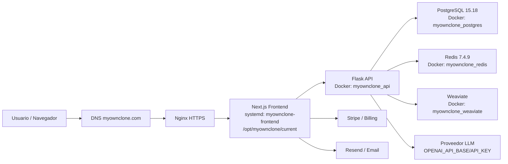
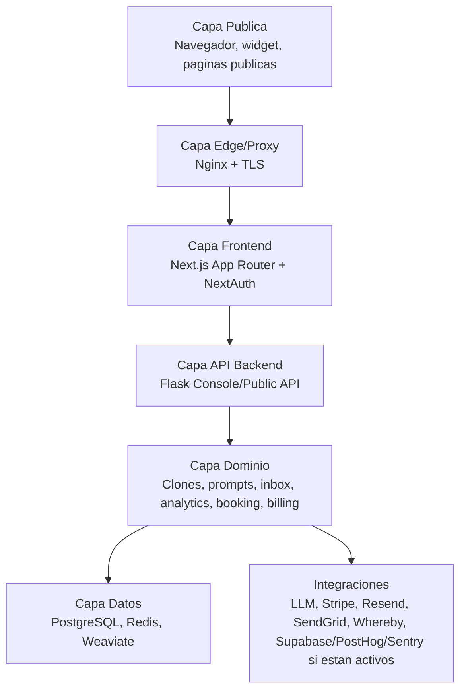
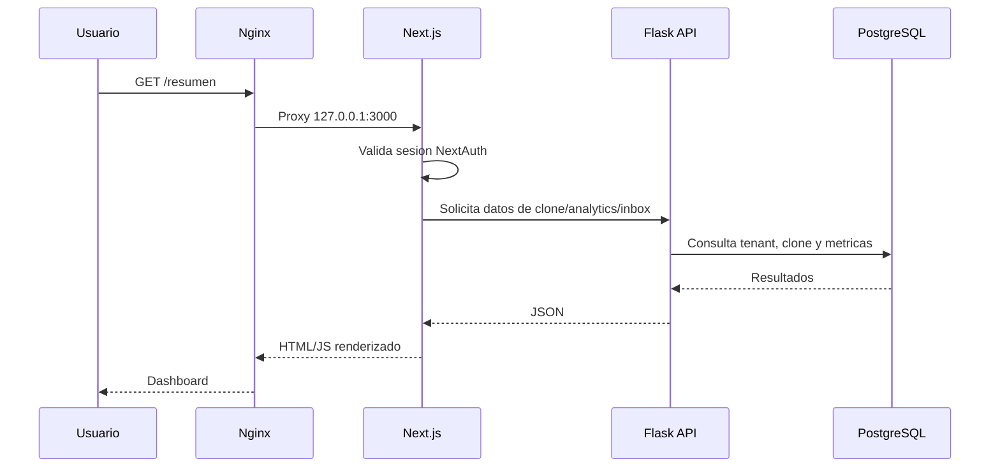
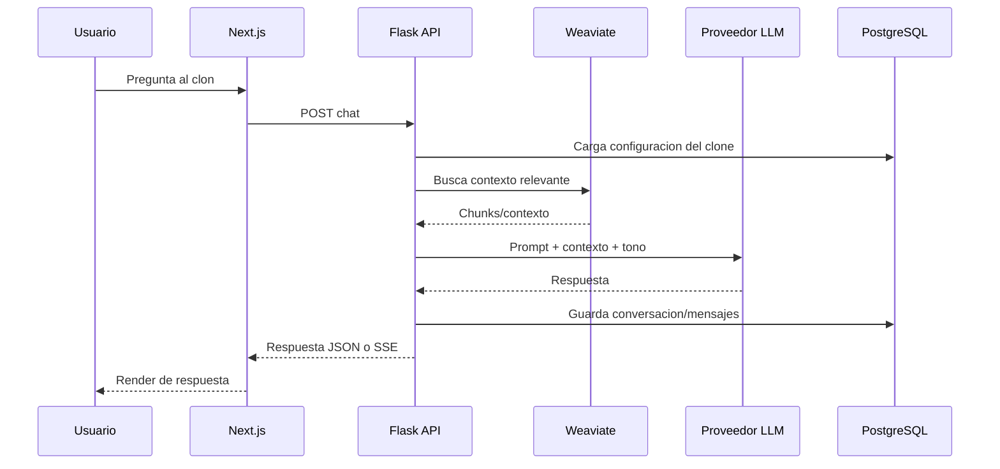
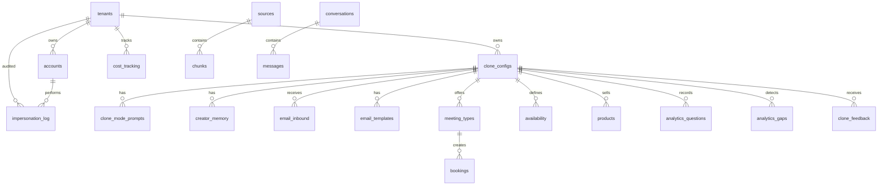

# Manual de Administracion de Sistemas - MyOwnClone

**Marca:** MyOwnClone  
**Sistema:** Plataforma SaaS multi-tenant de clones IA, knowledge base, chat, email triage, booking y billing  
**Version del manual:** v1.0.0-draft.1  
**Estado:** Paso 1 de documentacion incremental  
**Entorno documentado:** Produccion VPS  
**URL de produccion:** <https://myownclone.com/>  
**IP publica VPS:** `212.227.169.99`  
**Ruta activa en VPS:** `/opt/myownclone/current`  
**Release activa verificada:** `/opt/myownclone/releases/202606151645-dashboard-top-cards`  
**Autor:** Codex, Arquitectura y Documentacion Tecnica  
**Fecha del documento:** 2026-06-16  
**Ultima verificacion contra VPS:** 2026-06-16 06:49:40 UTC  
**Marca de agua conceptual:** PRODUCCION - VPS

> ADVERTENCIA: Este manual documenta la configuracion real observada en el VPS de produccion. No debe usarse para publicar secretos, passwords, tokens ni claves privadas. Cualquier valor sensible se documenta como `***REDACTED***` o mediante el nombre de la variable de entorno.

---

## Historial de Revisiones

| Version | Fecha | Autor | Alcance | Estado |
|---|---:|---|---|---|
| v1.0.0-draft.1 | 2026-06-16 | Codex | Portada, convenciones, indice maestro, glosario, vision general y snapshot inicial del VPS | En progreso |

---

## Convenciones del Documento

| Convencion | Significado |
|---|---|
| `comando` | Comando copiable de terminal. |
| `/ruta/absoluta` | Ruta absoluta en el VPS o en el repositorio. |
| `VARIABLE_DE_ENTORNO` | Variable configurada mediante archivo `.env`, systemd, Docker Compose o entorno de shell. |
| `***REDACTED***` | Valor sensible omitido de forma intencional. |
| PRODUCCION - VPS | Informacion verificada contra el servidor activo. |
| Pendiente de Paso N | Seccion reservada para completar en la fase indicada. |

### Niveles de aviso

> ADVERTENCIA: Accion con riesgo de caida, perdida de datos o exposicion de secretos.

> TIP: Recomendacion operativa para ahorrar tiempo o evitar errores comunes.

> COMANDO DE PRODUCCION: Ejecutar solo entendiendo el impacto en el VPS activo.

---

## Tabla de Contenidos

1. [Portada y Presentacion](#1-portada-y-presentacion)
2. [Vision General del Sistema](#2-vision-general-del-sistema)
3. [Arquitectura Tecnica del VPS](#3-arquitectura-tecnica-del-vps)
4. [Base de Datos en Produccion](#4-base-de-datos-en-produccion)
5. [Acceso al Servidor VPS](#5-acceso-al-servidor-vps)
6. [Instalacion y Configuracion](#6-instalacion-y-configuracion)
7. [Administracion del Sistema](#7-administracion-del-sistema)
8. [Funcionalidades por Modulo](#8-funcionalidades-por-modulo)
9. [Gestion de Seguridad en VPS](#9-gestion-de-seguridad-en-vps)
10. [API Documentation Produccion](#10-api-documentation-produccion)
11. [Mantenimiento del VPS](#11-mantenimiento-del-vps)
12. [Operaciones Comunes en VPS](#12-operaciones-comunes-en-vps)
13. [Troubleshooting en VPS](#13-troubleshooting-en-vps)
14. [Desarrollo y Despliegue](#14-desarrollo-y-despliegue)
15. [Comandos Utiles del VPS](#15-comandos-utiles-del-vps)
16. [Informacion de Contacto y Soporte](#16-informacion-de-contacto-y-soporte)
17. [Anexos](#17-anexos)

---

## Glosario

| Termino | Definicion |
|---|---|
| API | Interfaz HTTP usada por el frontend, clientes externos o integraciones para leer y modificar datos. |
| App Router | Sistema de rutas moderno de Next.js usado en el frontend. |
| Billing | Modulo de facturacion, planes, portal de pago y posible integracion con Stripe. |
| Clone | Instancia de asistente IA configurada para un tenant con nombre, slug, tono, prompts y modos. |
| Console | Zona privada autenticada para propietarios/admins del workspace. |
| Docker Compose | Orquestador local/VPS para backend Flask, PostgreSQL, Redis y Weaviate. |
| Frontend | Aplicacion Next.js servida por systemd y Nginx en produccion. |
| Knowledge Base | Conjunto de documentos, fuentes, memorias y embeddings usados para responder consultas. |
| Nginx | Servidor web y reverse proxy que publica HTTPS hacia el frontend. |
| NextAuth | Sistema de autenticacion del frontend basado en sesiones/cookies. |
| Plan | Paquete comercial con limites y funcionalidades de uso. |
| Produccion | Entorno real publicado en `https://myownclone.com/`. |
| RAG | Retrieval-Augmented Generation; patron de busqueda de contexto antes de generar respuesta IA. |
| Release | Carpeta versionada desplegada bajo `/opt/myownclone/releases/`. |
| SSE | Server-Sent Events; streaming HTTP para respuestas progresivas de chat. |
| Tenant | Cliente/workspace aislado dentro de la plataforma multi-tenant. |
| VPS | Servidor virtual privado donde corre la aplicacion en produccion. |
| Weaviate | Base vectorial usada para busqueda semantica y RAG. |

---

# 1. Portada y Presentacion

## 1.1 Branding del Proyecto

MyOwnClone se presenta como una plataforma SaaS para crear y operar clones de IA con conocimiento propio, capacidades de conversacion, gestion de fuentes, email triage, reservas y monetizacion. El branding funcional observado en el sitio usa:

| Elemento | Uso documentado |
|---|---|
| Nombre visible | MyOwnClone |
| Logo | Simbolo compacto de cuatro formas circulares/negras observado en la interfaz |
| Estilo visual | Dashboard limpio, fondo claro, tarjetas redondeadas, iconografia lineal y acentos de color |
| Colores principales observados | Negro `#111111`, blanco, grises suaves, acentos azul/cyan/rojo/naranja/verde |
| Tipografia | Tipografia sans-serif moderna definida por la app Next.js/Tailwind |

> Pendiente de Paso 8: incorporar screenshots reales anotados del sitio en vivo.

## 1.2 Identificacion del Sistema

| Campo | Valor |
|---|---|
| Nombre completo | MyOwnClone |
| Tipo de sistema | SaaS multi-tenant con agentes IA |
| URL de produccion | `https://myownclone.com/` |
| IP publica | `212.227.169.99` |
| Rama de despliegue documentada | `audit/vps-sync-and-docs` |
| Release activa | `/opt/myownclone/releases/202606151645-dashboard-top-cards` |
| Symlink activo | `/opt/myownclone/current` |
| Estado HTTPS verificado | `200 OK` |

## 1.3 Snapshot Inicial del VPS

Informacion verificada por SSH contra el VPS el 2026-06-16.

| Componente | Version / Estado |
|---|---|
| Hostname | `ubuntu` |
| Sistema operativo | Ubuntu 26.04 LTS |
| Kernel | `7.0.0-22-generic` |
| Nginx | `nginx/1.28.3 (Ubuntu)` |
| Node.js | `v22.22.3` |
| npm | `10.9.8` |
| Python | `Python 3.14.4` |
| Docker | `Docker version 29.1.3` |
| Docker Compose | `v5.1.4` |
| PostgreSQL container | `PostgreSQL 15.18` |
| Redis container | `Redis 7.4.9` |
| Frontend systemd | `myownclone-frontend: active` |
| Backend container | `myownclone_api: healthy` |
| PostgreSQL container | `myownclone_postgres: healthy` |
| Redis container | `myownclone_redis: healthy` |
| Weaviate container | `myownclone_weaviate: up` |
| Nginx site enabled | `myownclone` |

Comando de verificacion:

```bash
ssh myownclone-vps <<'EOF'
***REMOVED***
hostname
. /etc/os-release && echo "$PRETTY_NAME"
uname -r
readlink -f /opt/myownclone/current
systemctl is-active myownclone-frontend
nginx -v
node -v
npm -v
python3 --version
docker --version
docker compose version
docker ps --format '{{.Names}}={{.Status}}'
curl -sS -o /dev/null -w '%{http_code}\n' https://myownclone.com/
EOF
```

---

# 2. Vision General del Sistema

## 2.1 Descripcion Ejecutiva

MyOwnClone es una plataforma SaaS multi-tenant que permite a un usuario crear y administrar un clon de IA asociado a su workspace. El clon puede responder preguntas, consultar conocimiento cargado, operar con diferentes modos de comportamiento y servir como interfaz conversacional publica o privada.

La solucion combina:

- Frontend Next.js para landing, autenticacion, dashboard y paneles de gestion.
- Backend Flask para APIs de dominio MyOwnClone.
- PostgreSQL para datos relacionales.
- Redis para cache/estado operativo.
- Weaviate para busqueda vectorial.
- Integraciones externas para LLM, email, billing y analiticas.

## 2.2 Objetivos y Proposito

| Objetivo | Descripcion |
|---|---|
| Crear clones IA configurables | Permitir definir identidad, tono, prompts, avatar, modos y fuentes de conocimiento. |
| Centralizar conocimiento | Ingerir fuentes y memoria del creador para alimentar respuestas con contexto. |
| Reducir friccion operativa | Unificar dashboard, uso, settings, planes, inbox, bookings y productos. |
| Habilitar monetizacion | Exponer planes y facturacion para operar el SaaS comercialmente. |
| Soportar multi-tenant | Aislar configuracion y datos por workspace/tenant. |

## 2.3 Casos de Uso Principales

| Caso de uso | Actor | Resultado esperado |
|---|---|---|
| Registro y login | Usuario propietario | Acceso al dashboard privado. |
| Onboarding de clon | Usuario propietario | Primer clon creado con tono, slug y configuracion base. |
| Configuracion del clon | Usuario propietario | Ajuste de nombre, tono, prompts, tema y dominio. |
| Consulta del clon | Visitante o propietario | Respuesta IA basada en el modo y conocimiento disponible. |
| Gestion de fuentes | Usuario propietario | Documentos/fuentes cargadas para RAG. |
| Analiticas | Usuario propietario/admin | Visibilidad de uso, preguntas, gaps y coste. |
| Gestion de planes | Usuario propietario | Seleccion o upgrade de plan. |
| Administracion global | Admin plataforma | Supervision de tenants, auditoria e impersonation controlado. |

## 2.4 Usuarios Objetivo

| Perfil | Necesidad |
|---|---|
| Creator/Founder | Crear un clon que responda como el creador o represente su negocio. |
| Equipo comercial | Usar el clon para responder dudas, cualificar leads y recomendar productos. |
| Soporte | Automatizar respuestas recurrentes y detectar gaps de conocimiento. |
| Administrador SaaS | Gestionar tenants, seguridad, auditoria, billing y salud del sistema. |
| Visitante final | Interactuar con el clon publico o widget embebido. |

## 2.5 Beneficios y Valor Agregado

- Menor tiempo de respuesta a usuarios y leads.
- Experiencia centralizada para conocimiento, chat, reservas y monetizacion.
- Separacion multi-tenant para operar como SaaS.
- Base tecnica preparada para RAG y streaming.
- Dashboard orientado a accion con accesos rapidos a uso, documentos, agent toolkit y API keys.

## 2.6 Alcance Funcional Actual en Produccion

Segun el estado desplegado y verificado en VPS, el frontend publica rutas para:

- Landing publica.
- Login, registro, recuperacion y reset de password.
- Onboarding.
- Dashboard `/resumen`.
- Biblioteca/fuentes.
- Cerebro/agent toolkit.
- Configuracion/API keys.
- Analiticas.
- Inbox.
- Productos.
- Reuniones.
- Planes.
- Facturacion.
- Settings.
- Admin: resumen, tenants, auditoria, courtesy, feedback e impersonation.
- Widget publico `/widget.js`.
- Rutas publicas por slug `/{slug}`.

## 2.7 Limitaciones Conocidas

Estas limitaciones se documentan como riesgos tecnicos historicos y deben revisarse contra la version activa en pasos posteriores:

| Limitacion | Impacto | Estado |
|---|---|---|
| Registro de blueprint publico MyOwnClone | Puede afectar endpoints publicos Flask si no esta registrado. | Pendiente de verificacion profunda en Paso 10 |
| Inyeccion de memorias en prompt | Si `_add_memories_to_prompt()` no retorna, las memorias no enriquecen respuestas. | Pendiente de verificacion en Paso 8 |
| Tenant name en admin | Riesgo de mostrar `tenant_id` en vez de nombre real. | Pendiente de verificacion en Paso 7 |
| Autenticacion de cuentas bootstrap | Algunas credenciales historicas documentadas no autenticaron durante pruebas automaticas. | Requiere saneamiento controlado de usuarios en Paso 7 |
| `package-lock.json` desincronizado historico | Rompia `npm ci` en releases limpias. | Corregido en rama `audit/vps-sync-and-docs` |

## 2.8 Estado Actual en Produccion

| Area | Estado verificado |
|---|---|
| Dominio | `https://myownclone.com/` responde `200` |
| Frontend | Activo por systemd en `/opt/myownclone/current` |
| Backend Docker | Container `myownclone_api` saludable |
| PostgreSQL | Container `myownclone_postgres` saludable |
| Redis | Container `myownclone_redis` saludable |
| Weaviate | Container activo |
| Nginx | Sitio `myownclone` habilitado |
| Ultimo ajuste conocido | Dashboard muestra solo los 3 bloques superiores solicitados; se retiro bloque inferior Plan/Settings duplicado |

---

# 3. Arquitectura Tecnica del VPS

Esta seccion describe la arquitectura real observada en el VPS de produccion. La aplicacion se publica mediante Nginx en HTTPS, sirve el frontend Next.js como proceso systemd y ejecuta backend/servicios de datos mediante Docker Compose.

## 3.1 Infraestructura del Servidor

| Campo | Valor verificado |
|---|---|
| Proveedor | Pendiente de confirmar administrativamente; VPS accesible por IP publica `212.227.169.99` |
| Hostname | `ubuntu` |
| Sistema operativo | Ubuntu 26.04 LTS |
| Kernel | `7.0.0-22-generic` |
| CPU | 2 vCPU |
| RAM | 3.8 GiB |
| Swap | No configurada (`0B`) |
| Disco raiz | 116 GiB |
| Disco usado | 18 GiB |
| Disco disponible | 98 GiB |
| Uso de disco | 16% |
| IP publica | `212.227.169.99` |
| Dominio principal | `myownclone.com` |
| Dominio alternativo | `www.myownclone.com` |
| Red privada/Tailscale | Servicio `tailscaled` activo; IP Tailscale observada `100.125.128.116` |

Comandos usados para verificar recursos:

```bash
ssh myownclone-vps <<'EOF'
nproc
free -h
df -h / /opt
hostname
. /etc/os-release && echo "$PRETTY_NAME"
uname -r
EOF
```

## 3.2 Diagrama de Arquitectura de Produccion



## 3.3 Flujo de Red y Puertos

| Puerto | Bind | Proceso | Exposicion | Funcion |
|---:|---|---|---|---|
| 22 | `0.0.0.0`, `[::]` | `sshd` | Publico | Acceso SSH al VPS. |
| 80 | `0.0.0.0`, `[::]` | `nginx` | Publico | Redireccion HTTP a HTTPS. |
| 443 | `0.0.0.0`, `[::]` | `nginx` | Publico | Entrada HTTPS principal. |
| 3000 | `127.0.0.1` | `next-server` | Solo local | Frontend Next.js. |
| 5001 | `127.0.0.1` | `docker-proxy` -> Flask API | Solo local | Backend API Flask. |
| 5432 | `127.0.0.1` | `docker-proxy` -> PostgreSQL | Solo local | Base de datos PostgreSQL. |
| 8080 | `127.0.0.1` | `docker-proxy` -> Weaviate | Solo local | Base vectorial Weaviate. |
| 6379 | Docker network | Redis | No publicado en host | Cache/estado Redis. |

> ADVERTENCIA: PostgreSQL, Flask API y Weaviate estan publicados solo en loopback. No deben abrirse a Internet salvo necesidad explicita y con controles adicionales.

Comando de diagnostico:

```bash
ssh myownclone-vps 'ss -ltnp'
```

## 3.4 Reverse Proxy Nginx

Nginx expone el dominio publico, termina TLS y enruta trafico hacia frontend o backend segun la ruta.

Archivo activo:

```text
/etc/nginx/sites-enabled/myownclone
```

Resumen de bloques:

| Ruta | Destino upstream | Proposito |
|---|---|---|
| `http://myownclone.com/*` | Redirect 301 a HTTPS | Forzar TLS. |
| `/` | `http://127.0.0.1:3000` | Frontend Next.js. |
| `/api/auth/login` | `http://127.0.0.1:5001/console/api/auth/login` | Login backend heredado/console. |
| `/api/myownclone/` | `http://127.0.0.1:5001/console/api/myownclone/` | Console API MyOwnClone. |
| `/api/admin/` | `http://127.0.0.1:5001/console/api/myownclone/admin/` | API admin con headers de servicio. |
| `/console/` | `http://127.0.0.1:5001` | Acceso directo a backend console. |

Configuracion TLS observada:

| Campo | Valor |
|---|---|
| Certificado | `/etc/letsencrypt/live/myownclone.com/fullchain.pem` |
| Clave privada | `/etc/letsencrypt/live/myownclone.com/privkey.pem` |
| Emisor | Let's Encrypt `YE1` |
| Subject | `CN=myownclone.com` |
| Valido desde | 2026-06-15 09:50:54 GMT |
| Expira | 2026-09-13 09:50:53 GMT |
| Max upload | `client_max_body_size 25m` |

> ADVERTENCIA: El bloque `/api/admin/` inyecta headers internos de autenticacion de servicio. El valor real de `X-API-Key` no debe copiarse a documentacion publica ni repositorio.

Comandos de verificacion:

```bash
ssh myownclone-vps 'nginx -t && systemctl status nginx --no-pager'
ssh myownclone-vps 'openssl x509 -in /etc/letsencrypt/live/myownclone.com/fullchain.pem -noout -subject -issuer -dates'
```

## 3.5 Frontend Next.js como Servicio systemd

Servicio activo:

```text
/etc/systemd/system/myownclone-frontend.service
```

Configuracion operativa:

| Campo | Valor |
|---|---|
| Unit | `myownclone-frontend.service` |
| Usuario | `myownclone` |
| Grupo | `myownclone` |
| WorkingDirectory | `/opt/myownclone/current` |
| EnvironmentFile | `/opt/myownclone/shared/frontend.env.production` |
| ExecStart | `/usr/bin/npm run start -- --hostname ${HOSTNAME} --port ${PORT}` |
| Restart | `always` |
| RestartSec | `5` |
| TimeoutStartSec | `120` |
| Seguridad systemd | `NoNewPrivileges=true`, `PrivateTmp=true`, `ProtectHome=read-only`, restricciones de kernel/control groups |
| Logs | `journalctl -u myownclone-frontend` |

Variables clave del frontend, sin valores:

```env
NODE_ENV=***REDACTED***
PORT=***REDACTED***
HOSTNAME=***REDACTED***
DATABASE_URL=***REDACTED***
MYOWNCLONE_API_URL=***REDACTED***
MYOWNCLONE_SERVICE_API_KEY=***REDACTED***
SERVICE_API_KEY=***REDACTED***
DEFAULT_CLONE_ID=***REDACTED***
DEFAULT_PLAN=***REDACTED***
AUTH_URL=***REDACTED***
NEXTAUTH_URL=***REDACTED***
AUTH_TRUST_HOST=***REDACTED***
AUTH_SECRET=***REDACTED***
NEXTAUTH_SECRET=***REDACTED***
PLATFORM_ADMIN_EMAIL=***REDACTED***
PLATFORM_ADMIN_PASSWORD_HASH=***REDACTED***
AUTH_GOOGLE_ID=***REDACTED***
AUTH_GOOGLE_SECRET=***REDACTED***
RESEND_API_KEY=***REDACTED***
RESEND_FROM_EMAIL=***REDACTED***
NEXT_PUBLIC_APP_URL=***REDACTED***
NEXT_PUBLIC_API_URL=***REDACTED***
NEXT_PUBLIC_ADMIN_URL=***REDACTED***
NEXT_PUBLIC_STRIPE_PUBLISHABLE_KEY=***REDACTED***
ANTHROPIC_API_KEY=***REDACTED***
OPENAI_API_KEY=***REDACTED***
STRIPE_BASIC_PRICE_ID=***REDACTED***
STRIPE_PRO_PRICE_ID=***REDACTED***
STRIPE_SCALE_PRICE_ID=***REDACTED***
SENDGRID_INBOUND_WEBHOOK_SECRET=***REDACTED***
WHEREBY_API_KEY=***REDACTED***
NEXT_PUBLIC_POSTHOG_KEY=***REDACTED***
NEXT_PUBLIC_POSTHOG_HOST=***REDACTED***
NEXT_PUBLIC_SENTRY_DSN=***REDACTED***
SENTRY_ORG=***REDACTED***
SENTRY_PROJECT=***REDACTED***
SUPABASE_URL=***REDACTED***
SUPABASE_ANON_KEY=***REDACTED***
SUPABASE_SERVICE_ROLE_KEY=***REDACTED***
```

Comandos de operacion:

```bash
ssh myownclone-vps 'systemctl is-active myownclone-frontend'
ssh myownclone-vps 'journalctl -u myownclone-frontend -n 100 --no-pager'
ssh myownclone-vps 'systemctl restart myownclone-frontend'
```

## 3.6 Backend y Servicios Docker

El backend y servicios de datos se gestionan con Docker Compose. El archivo productivo observado vive en:

```text
/opt/myownclone/bootstrap/ops/docker-compose.backend.prod.yml
```

Servicios activos:

| Servicio | Container | Imagen | Puerto host | Estado observado |
|---|---|---|---|---|
| API Flask | `myownclone_api` | `ops-api` | `127.0.0.1:5001` | Up, healthy |
| PostgreSQL + pgvector | `myownclone_postgres` | `pgvector/pgvector:pg15` | `127.0.0.1:5432` | Up, healthy |
| Redis | `myownclone_redis` | `redis:7-alpine` | Interno Docker | Up, healthy |
| Weaviate | `myownclone_weaviate` | `cr.weaviate.io/semitechnologies/weaviate:1.24.0` | `127.0.0.1:8080` | Up |

Volumenes Docker:

| Volumen | Uso |
|---|---|
| `postgres_data` | Datos PostgreSQL. |
| `redis_data` | Persistencia Redis AOF. |
| `weaviate_data` | Persistencia vectorial Weaviate. |

Variables clave del backend, sin valores:

```env
DB_PASSWORD=***REDACTED***
REDIS_PASSWORD=***REDACTED***
JWT_SECRET_KEY=***REDACTED***
IMPERSONATION_TOKEN_PEPPER=***REDACTED***
DB_USER=***REDACTED***
DB_HOST=***REDACTED***
DB_PORT=***REDACTED***
DB_NAME=***REDACTED***
DATABASE_URL=***REDACTED***
FLASK_ENV=***REDACTED***
LOG_LEVEL=***REDACTED***
SECRET_KEY=***REDACTED***
ALLOWED_ORIGINS=***REDACTED***
SERVICE_API_KEY=***REDACTED***
ALLOW_DEV_SERVICE_KEY=***REDACTED***
WEAVIATE_API_KEY=***REDACTED***
WEAVIATE_URL=***REDACTED***
OPENAI_API_KEY=***REDACTED***
OPENAI_BASE_URL=***REDACTED***
OPENAI_API_BASE=***REDACTED***
OPENAI_MODEL=***REDACTED***
ANTHROPIC_API_KEY=***REDACTED***
ANTHROPIC_MODEL=***REDACTED***
MINIMAX_API_KEY=***REDACTED***
MINIMAX_MODEL=***REDACTED***
TOGETHER_API_KEY=***REDACTED***
TOGETHER_MODEL=***REDACTED***
STRIPE_SECRET_KEY=***REDACTED***
STRIPE_WEBHOOK_SECRET=***REDACTED***
SENDGRID_INBOUND_WEBHOOK_SECRET=***REDACTED***
WHEREBY_API_KEY=***REDACTED***
RESEND_API_KEY=***REDACTED***
RESEND_FROM_EMAIL=***REDACTED***
APP_URL=***REDACTED***
```

Comandos de diagnostico:

```bash
ssh myownclone-vps 'docker ps'
ssh myownclone-vps 'docker logs --tail=100 myownclone_api'
ssh myownclone-vps 'docker exec myownclone_api curl -fsS http://127.0.0.1:5001/readyz'
```

## 3.7 Estructura del Proyecto en VPS

Rutas principales:

| Ruta | Propietario | Proposito |
|---|---|---|
| `/opt/myownclone/bootstrap` | `root:root` mayoritariamente | Copia/bootstrap del repositorio y scripts operativos. |
| `/opt/myownclone/releases` | `myownclone:myownclone` en releases recientes | Releases historicas y actual. |
| `/opt/myownclone/current` | Symlink | Apunta a la release activa del frontend. |
| `/opt/myownclone/shared` | `myownclone:myownclone`, modo `700` | Env reales y secretos compartidos entre releases. |
| `/opt/myownclone/shared/frontend.env.production` | `myownclone:myownclone`, modo `600` | Variables reales del frontend. |
| `/opt/myownclone/shared/backend.env.production` | `myownclone:myownclone`, modo `600` | Variables reales del backend. |
| `/opt/myownclone/shared/admin-bootstrap.txt` | `myownclone:myownclone`, modo `600` | Datos bootstrap sensibles. |

Release activa:

```text
/opt/myownclone/current -> /opt/myownclone/releases/202606151645-dashboard-top-cards
```

> TIP: El symlink `/opt/myownclone/current` permite rollback rapido cambiando el enlace a una release anterior y reiniciando `myownclone-frontend`.

Comandos utiles:

```bash
ssh myownclone-vps 'readlink -f /opt/myownclone/current'
ssh myownclone-vps 'ls -la /opt/myownclone'
ssh myownclone-vps 'find /opt/myownclone/shared -maxdepth 1 -ls'
```

## 3.8 Stack Tecnologico en Produccion

| Capa | Tecnologia | Version observada |
|---|---|---|
| SO | Ubuntu | 26.04 LTS |
| Reverse proxy | Nginx | 1.28.3 |
| Runtime frontend | Node.js | 22.22.3 |
| Package manager | npm | 10.9.8 |
| Framework frontend | Next.js | 16.2.9 |
| UI runtime | React | 19.2.4 |
| Auth frontend | NextAuth | 5 beta 25 |
| ORM frontend | Drizzle ORM | 0.45.2 |
| Runtime backend | Python | 3.14.4 en host; backend corre dentro de container |
| Backend web | Flask | definido por `requirements.txt`/imagen API |
| DB relacional | PostgreSQL + pgvector | 15.18 |
| Cache/estado | Redis | 7.4.9 |
| Vector DB | Weaviate | 1.24.0 |
| Containers | Docker | 29.1.3 |
| Compose | Docker Compose | 5.1.4 |
| SSL | Let's Encrypt | Certificado vigente hasta 2026-09-13 |

Dependencias destacadas del frontend productivo:

| Paquete | Version |
|---|---|
| `next` | `16.2.9` |
| `react` | `19.2.4` |
| `react-dom` | `19.2.4` |
| `next-auth` | `^5.0.0-beta.25` |
| `drizzle-orm` | `^0.45.2` |
| `stripe` | `^17.1.0` |
| `resend` | `^4.0.1` |
| `openai` | `^4.72.0` |
| `@anthropic-ai/sdk` | `^0.36.0` |
| `framer-motion` | `^12.40.0` |
| `@phosphor-icons/react` | `^2.1.10` |

## 3.9 Modelo de Capas



Responsabilidades:

| Capa | Responsabilidad |
|---|---|
| Nginx | TLS, redirects, routing, headers proxy, limite de subida. |
| Next.js | UI, auth, rutas privadas/publicas, API routes propias, comunicacion con backend. |
| Flask API | Contratos de dominio MyOwnClone, admin, clones, analytics, booking, stripe, inbox. |
| PostgreSQL | Persistencia relacional multi-tenant. |
| Redis | Cache/estado y soporte operativo. |
| Weaviate | Busqueda vectorial para RAG. |
| Integraciones externas | LLM, pagos, email, videollamadas, analitica/observabilidad. |

## 3.10 Flujo de Datos Principal

### 3.10.1 Carga del Dashboard



### 3.10.2 Consulta de Chat/RAG



## 3.11 Patrones de Diseno Implementados

| Patron | Uso en MyOwnClone |
|---|---|
| Reverse Proxy | Nginx desacopla Internet de procesos internos. |
| Release Symlink | `/opt/myownclone/current` apunta a una release versionada para rollback. |
| Twelve-Factor Env | Configuracion sensible fuera del repo en `/opt/myownclone/shared/*.env.production`. |
| Multi-tenant | Datos y recursos asociados a tenant/workspace. |
| RAG | Weaviate recupera contexto antes de generar respuestas IA. |
| API Gateway ligero | Nginx reescribe rutas `/api/*` hacia Flask/Next segun necesidad. |
| Health Checks | Docker healthchecks en API, PostgreSQL y Redis. |
| Defense in Depth | Servicios internos en loopback, TLS publico, systemd hardening parcial. |

## 3.12 Logs y Observabilidad

| Componente | Ubicacion / Comando |
|---|---|
| Frontend Next.js | `journalctl -u myownclone-frontend` |
| Nginx access/error | `/var/log/nginx/` |
| Backend API | `docker logs myownclone_api` |
| PostgreSQL | `docker logs myownclone_postgres` |
| Redis | `docker logs myownclone_redis` |
| Weaviate | `docker logs myownclone_weaviate` |
| System journal | `/var/log/journal` |

Comandos:

```bash
ssh myownclone-vps 'journalctl -u myownclone-frontend -f'
ssh myownclone-vps 'tail -f /var/log/nginx/access.log /var/log/nginx/error.log'
ssh myownclone-vps 'docker logs -f --tail=100 myownclone_api'
```

## 3.13 Servicios Activos Relevantes

Servicios del sistema observados en ejecucion:

| Servicio | Funcion |
|---|---|
| `ssh.service` | Acceso remoto. |
| `nginx.service` | Reverse proxy HTTP/HTTPS. |
| `myownclone-frontend.service` | Frontend Next.js. |
| `docker.service` | Runtime de containers. |
| `containerd.service` | Runtime base de containers. |
| `cron.service` | Programacion de tareas. |
| `rsyslog.service` | Logging del sistema. |
| `chrony.service` | Sincronizacion de tiempo. |
| `tailscaled.service` | Red privada Tailscale. |
| `unattended-upgrades.service` | Actualizaciones automaticas del sistema. |

> Pendiente de Paso 6: validar firewall, fail2ban, cron jobs concretos y politicas de backup/retencion.

---

# 4. Base de Datos en Produccion

La base de datos de produccion corre en el container Docker `myownclone_postgres`, basado en `pgvector/pgvector:pg15`, publicada solo en loopback del VPS mediante `127.0.0.1:5432`.

## 4.1 Identificacion de la Base de Datos

| Campo | Valor verificado |
|---|---|
| Motor | PostgreSQL 15.18 con pgvector |
| Container | `myownclone_postgres` |
| Imagen | `pgvector/pgvector:pg15` |
| Base de datos | `myownclone` |
| Usuario | `postgres` |
| Host desde VPS | `127.0.0.1` |
| Host desde Docker network | `db_postgres` |
| Puerto host | `5432` |
| Exposicion publica | No, solo loopback |
| Volumen Docker | `postgres_data:/var/lib/postgresql/data` |
| Alembic version | `c3d4e5f6a7c1` |

Comandos de conexion:

```bash
# Desde el VPS, sin exponer password en el comando
ssh myownclone-vps

docker exec -it myownclone_postgres psql -U postgres -d myownclone
```

## 4.2 Extensiones, Vistas, Triggers y Rutinas

| Tipo | Estado en produccion |
|---|---|
| Extension `plpgsql` | Activa, version `1.0` |
| Extension `uuid-ossp` | Activa, version `1.1` |
| Extension `vector` | Activa, version `0.8.2` |
| Vistas custom | No se encontraron vistas en schema `public` |
| Triggers custom | No se encontraron triggers en schema `public` |
| Rutinas custom | No se encontraron rutinas propias de negocio; las funciones listadas pertenecen a `uuid-ossp` y `pgvector` |

## 4.3 Diagrama Entidad-Relacion



## 4.4 Inventario de Tablas y Conteos

| Tabla | Registros | Tamano total | Proposito |
|---|---:|---:|---|
| `accounts` | 2 | 96 kB | Cuentas de usuario/tenant y admins plataforma. |
| `admin_audit_log` | 0 | 48 kB | Auditoria de acciones administrativas. |
| `alembic_version` | 1 | 24 kB | Version de migracion Flask/Alembic. |
| `analytics_gaps` | 0 | 24 kB | Preguntas sin respuesta/gaps de conocimiento. |
| `analytics_questions` | 0 | 24 kB | Preguntas frecuentes agregadas. |
| `availability` | 0 | 16 kB | Disponibilidad semanal para reservas. |
| `bookings` | 0 | 24 kB | Reservas creadas por visitantes. |
| `chunks` | 0 | 24 kB | Fragmentos de fuentes para RAG. |
| `clone_configs` | 1 | 80 kB | Configuracion principal de clones. |
| `clone_feedback` | 0 | 32 kB | Feedback de respuestas/conversaciones. |
| `clone_mode_prompts` | 0 | 24 kB | Prompts por modo del clon. |
| `conversations` | 0 | 24 kB | Conversaciones persistidas. |
| `cost_tracking` | 0 | 16 kB | Tracking de coste por tenant/operacion. |
| `creator_memory` | 0 | 24 kB | Memorias del creador para contexto IA. |
| `email_inbound` | 0 | 24 kB | Emails recibidos y clasificados. |
| `email_templates` | 0 | 24 kB | Plantillas de email. |
| `impersonation_log` | 0 | 32 kB | Sesiones de impersonation admin. |
| `impersonation_tokens` | 0 | 16 kB | Tokens de impersonation. |
| `meeting_types` | 0 | 24 kB | Tipos de reunion ofrecidos. |
| `messages` | 0 | 24 kB | Mensajes dentro de conversaciones. |
| `myownclone_plans` | 3 | 24 kB | Planes comerciales cargados. |
| `products` | 0 | 24 kB | Catalogo de productos del clon. |
| `sources` | 0 | 32 kB | Fuentes/documentos de knowledge base. |
| `tenants` | 1 | 80 kB | Workspaces/tenants SaaS. |

> ADVERTENCIA: Los conteos son una fotografia del 2026-06-16. Deben regenerarse antes de auditorias o restauraciones.

Comando para refrescar conteos:

```bash
ssh myownclone-vps <<'EOF'
for t in $(docker exec myownclone_postgres psql -U postgres -d myownclone -Atc "select tablename from pg_tables where schemaname='public' order by tablename"); do
  c=$(docker exec myownclone_postgres psql -U postgres -d myownclone -Atc "select count(*) from public.$t")
  printf '%s|%s\n' "$t" "$c"
***REMOVED***
EOF
```

## 4.5 Diccionario de Datos por Tabla

### `tenants`

| Campo | Tipo | Null | Default | Restricciones / Relaciones |
|---|---|---|---|---|
| `id` | varchar(36) | NO | - | PK |
| `name` | varchar(255) | NO | - | Nombre del tenant |
| `slug` | varchar(100) | YES | - | UNIQUE (`tenants_slug_key`, `idx_tenants_slug`) |
| `plan` | varchar(50) | NO | `trial` | Plan actual |
| `status` | varchar(50) | NO | `trial` | Estado tenant; index `idx_tenants_status` |
| `subscription_status` | varchar(50) | NO | `inactive` | Estado billing |
| `stripe_customer_id` | varchar(255) | YES | - | Cliente Stripe |
| `stripe_subscription_id` | varchar(255) | YES | - | Suscripcion Stripe |
| `trial_ends_at` | timestamp | YES | - | Fin trial |
| `created_at` | timestamp | NO | `CURRENT_TIMESTAMP` | Auditoria |
| `updated_at` | timestamp | NO | `CURRENT_TIMESTAMP` | Auditoria |

### `accounts`

| Campo | Tipo | Null | Default | Restricciones / Relaciones |
|---|---|---|---|---|
| `id` | varchar(36) | NO | - | PK |
| `tenant_id` | varchar(36) | NO | - | FK -> `tenants.id`, index `idx_accounts_tenant` |
| `email` | varchar(255) | NO | - | UNIQUE (`accounts_email_key`, `idx_accounts_email`) |
| `password` | varchar(255) | YES | - | Hash/credencial; no documentar valores |
| `name` | varchar(255) | YES | - | Nombre visible |
| `avatar` | varchar(500) | YES | - | URL avatar |
| `role` | varchar(50) | NO | `owner` | Rol tenant |
| `status` | varchar(50) | NO | `active` | Estado cuenta |
| `is_platform_admin` | boolean | NO | `false` | Index `idx_accounts_platform_admin` |
| `last_login_at` | timestamp | YES | - | Ultimo login |
| `created_at` | timestamp | NO | `CURRENT_TIMESTAMP` | Auditoria |
| `updated_at` | timestamp | NO | `CURRENT_TIMESTAMP` | Auditoria |

### `clone_configs`

| Campo | Tipo | Null | Default | Restricciones / Relaciones |
|---|---|---|---|---|
| `id` | varchar(36) | NO | `uuid_generate_v4()` | PK |
| `tenant_id` | varchar(36) | NO | - | FK -> `tenants.id`, index `idx_clone_configs_tenant` |
| `name` | varchar(255) | NO | - | Nombre del clon |
| `slug` | varchar(100) | NO | - | UNIQUE, index `idx_clone_configs_slug` |
| `description` | text | YES | - | Descripcion publica/interna |
| `avatar_url` | varchar(500) | YES | - | Avatar del clon |
| `personality_tone` | varchar(50) | YES | - | Tono, normalizado actualmente como `tecnico` si aplica |
| `language` | varchar(10) | NO | `es` | Idioma |
| `active_modes` | varchar[] | YES | `{teach}` | Modos activos |
| `is_active` | boolean | NO | `true` | Habilitado/deshabilitado |
| `custom_domain` | varchar(255) | YES | - | Dominio custom |
| `created_at` | timestamp | NO | `CURRENT_TIMESTAMP` | Auditoria |
| `updated_at` | timestamp | NO | `CURRENT_TIMESTAMP` | Auditoria |

### Tablas de conocimiento, chat y RAG

| Tabla | Campos principales | Relaciones / Indices |
|---|---|---|
| `sources` | `id`, `clone_id`, `type`, `title`, `url`, `status`, `metadata`, `created_at`, `updated_at` | PK `sources_pkey`; indices `idx_sources_clone`, `idx_sources_status` |
| `chunks` | `id`, `source_id`, `content`, `embedding`, `token_count`, `metadata` | FK `source_id` -> `sources.id`; index `idx_chunks_source` |
| `conversations` | `id`, `clone_id`, `visitor_id`, `mode`, `created_at` | PK; index `idx_conversations_clone` |
| `messages` | `id`, `conversation_id`, `role`, `content`, `confidence`, `sources`, `feedback`, `created_at` | FK `conversation_id` -> `conversations.id`; index `idx_messages_conversation` |
| `creator_memory` | `id`, `clone_id`, `type`, `content`, `trigger_condition`, `priority`, timestamps | FK -> `clone_configs.id`; index `idx_creator_memory_clone_type` |
| `clone_mode_prompts` | `id`, `clone_id`, `mode`, `system_prompt`, `is_active`, timestamps | FK -> `clone_configs.id`; index `idx_mode_prompts_clone` |

### Tablas de email, booking, productos y analytics

| Tabla | Campos principales | Relaciones / Indices |
|---|---|---|
| `email_inbound` | `id`, `clone_id`, `from_email`, `subject`, `body_text`, `draft_reply`, `status`, `labels`, `classification`, `thread_id`, `received_at`, `responded_at` | FK -> `clone_configs.id`; index `idx_email_inbound_clone_status` |
| `email_templates` | `id`, `clone_id`, `name`, `subject`, `body`, `trigger_keywords`, timestamps | FK -> `clone_configs.id`; index `idx_email_templates_clone_id` |
| `meeting_types` | `id`, `clone_id`, `name`, `duration_minutes`, `price_cents`, `description`, `color`, `active`, timestamps | FK -> `clone_configs.id`; index `idx_meeting_types_clone_id` |
| `availability` | `id`, `clone_id`, `day_of_week`, `start_time`, `end_time`, `buffer_minutes`, timestamps | FK -> `clone_configs.id`; index `idx_availability_clone_dow` |
| `bookings` | `id`, `meeting_type_id`, visitor data, `date`, `start_time`, `end_time`, `status`, `meeting_url`, `recording_url`, `transcript`, `notes`, timestamps | FK -> `meeting_types.id`; index `idx_bookings_meeting_date` |
| `products` | `id`, `clone_id`, `name`, `description`, `price_cents`, `url`, `image_url`, `priority`, `active`, timestamps | FK -> `clone_configs.id`; index `idx_products_clone_active` |
| `analytics_questions` | `id`, `clone_id`, `question`, `count`, `last_asked_at`, timestamps | FK -> `clone_configs.id`; index `idx_analytics_q_clone` |
| `analytics_gaps` | `id`, `clone_id`, `question`, `count`, `suggested_source`, `status`, timestamps | FK -> `clone_configs.id`; index `idx_analytics_gaps_clone` |
| `cost_tracking` | `id`, `tenant_id`, `category`, `operation`, `model`, `tokens_in`, `tokens_out`, `cost_cents`, timestamps | FK -> `tenants.id`; index `idx_cost_tracking_tenant_category_ts` |

### Tablas de administracion y billing

| Tabla | Campos principales | Relaciones / Indices |
|---|---|---|
| `myownclone_plans` | `id`, `name`, `price_cents`, `stripe_price_id`, limits, flags de features, timestamps | PK; 3 registros en produccion |
| `impersonation_log` | `id`, `admin_id`, `tenant_id`, `reason`, `started_at`, `ended_at`, timestamps | FK `admin_id` -> `accounts.id`; FK `tenant_id` -> `tenants.id`; indices admin/tenant |
| `impersonation_tokens` | `id`, `token`, `admin_id`, `tenant_id`, `expires_at`, timestamps | UNIQUE `token`; no FK declarada observada |
| `admin_audit_log` | `id`, `actor_id`, `action`, `target_type`, `target_id`, `reason`, `metadata_json`, `ip_address`, `user_agent`, timestamps | Indices por actor, action, target y created_at |
| `clone_feedback` | `id`, `clone_id`, `tenant_id`, visitor/conversation/message, `rating`, `comment`, `category`, `status`, `extra_metadata`, timestamps | FK -> clone y tenant; indices clone/tenant |
| `alembic_version` | `version_num` | PK; version actual `c3d4e5f6a7c1` |

## 4.6 Indices Principales

Los indices mas relevantes en produccion son:

| Tabla | Indices |
|---|---|
| `accounts` | `accounts_email_key`, `idx_accounts_email`, `idx_accounts_platform_admin`, `idx_accounts_tenant` |
| `clone_configs` | `clone_configs_slug_key`, `idx_clone_configs_slug`, `idx_clone_configs_tenant` |
| `sources` | `idx_sources_clone`, `idx_sources_status` |
| `chunks` | `idx_chunks_source` |
| `conversations` | `idx_conversations_clone` |
| `messages` | `idx_messages_conversation` |
| `email_inbound` | `idx_email_inbound_clone_status` |
| `meeting_types` | `idx_meeting_types_clone_id` |
| `availability` | `idx_availability_clone_dow` |
| `bookings` | `idx_bookings_meeting_date` |
| `products` | `idx_products_clone_active` |
| `analytics_gaps` | `idx_analytics_gaps_clone` |
| `analytics_questions` | `idx_analytics_q_clone` |
| `admin_audit_log` | `idx_admin_audit_actor`, `idx_admin_audit_action`, `idx_admin_audit_target`, `idx_admin_audit_created` |

## 4.7 Scripts de Respaldo y Restauracion Base

Backup logico recomendado:

```bash
ssh myownclone-vps <<'EOF'
***REMOVED***
mkdir -p /opt/myownclone/backups
stamp=$(date -u +%Y%m%dT%H%M%SZ)
docker exec myownclone_postgres pg_dump -U postgres -d myownclone -Fc > "/opt/myownclone/backups/myownclone_${stamp}.dump"
chmod 600 "/opt/myownclone/backups/myownclone_${stamp}.dump"
ls -lh "/opt/myownclone/backups/myownclone_${stamp}.dump"
EOF
```

Restauracion en entorno controlado:

```bash
# No ejecutar sobre produccion sin ventana de mantenimiento y backup previo.
docker exec -i myownclone_postgres pg_restore -U postgres -d myownclone --clean --if-exists < backup.dump
```

> ADVERTENCIA: La restauracion con `--clean` elimina/recrea objetos. Requiere ventana de mantenimiento y validacion previa.

# 5. Acceso al Servidor VPS

## 5.1 Acceso SSH

El acceso operativo actual se realiza mediante alias SSH local:

```bash
ssh myownclone-vps
```

Equivalente generico:

```bash
ssh root@212.227.169.99 -p 22
```

| Campo | Valor |
|---|---|
| IP publica | `212.227.169.99` |
| Puerto SSH | `22` |
| Usuario operativo observado | `root` para administracion del VPS |
| Usuario runtime app | `myownclone` |
| Alias local recomendado | `myownclone-vps` |
| SFTP | Disponible sobre SSH: `sftp root@212.227.169.99` |

> ADVERTENCIA: No usar password plano en scripts. Usar llave SSH y alias local. Si se rota la llave, actualizar `~/.ssh/config` y probar una sesion nueva antes de cerrar la actual.

Comandos utiles:

```bash
ssh myownclone-vps 'whoami && hostname && pwd'
sftp root@212.227.169.99
scp archivo.tar myownclone-vps:/tmp/archivo.tar
```

## 5.2 Usuarios del Sistema

| Usuario | Uso |
|---|---|
| `root` | Administracion del VPS, systemd, Nginx, Docker y archivos de sistema. |
| `myownclone` | Usuario runtime del frontend y propietario de releases/env compartidos. |

## 5.3 Servicios en Ejecucion

| Servicio | Estado esperado | Funcion |
|---|---|---|
| `ssh.service` | active | Acceso remoto. |
| `nginx.service` | active | Reverse proxy HTTP/HTTPS. |
| `myownclone-frontend.service` | active | Frontend Next.js. |
| `docker.service` | active | Runtime de containers backend. |
| `containerd.service` | active | Runtime base de Docker. |
| `cron.service` | active | Tareas programadas del sistema. |
| `rsyslog.service` | active | Logs del sistema. |
| `chrony.service` | active | Sincronizacion horaria. |
| `tailscaled.service` | active | Red privada Tailscale. |
| `unattended-upgrades.service` | active | Actualizaciones automaticas OS. |

```bash
ssh myownclone-vps 'systemctl --type=service --state=running --no-pager'
```

## 5.4 Firewall y Proteccion de Acceso

| Componente | Estado |
|---|---|
| UFW | `inactive` |
| fail2ban | `inactive` / `fail2ban-client` no instalado |
| SSH | Publicado en puerto 22 |
| Nginx | Publicado en 80/443 |
| Servicios app internos | Bind a `127.0.0.1` o Docker network |

> ADVERTENCIA: UFW y fail2ban no estan activos. La exposicion se reduce porque app/DB estan en loopback, pero SSH queda publico. Recomendacion prioritaria: habilitar UFW y fail2ban tras confirmar acceso por llave.

Reglas UFW recomendadas, no aplicadas automaticamente:

```bash
ufw allow OpenSSH
ufw allow 80/tcp
ufw allow 443/tcp
ufw enable
ufw status verbose
```

Instalacion fail2ban recomendada:

```bash
apt update
apt install -y fail2ban
systemctl enable --now fail2ban
fail2ban-client status
```

## 5.5 Cron Jobs

| Fuente | Estado |
|---|---|
| `crontab -l` para root | No existe crontab root |
| `/etc/cron.d/certbot` | Existe, renovacion SSL automatica |
| `/etc/cron.d/e2scrub_all` | Existe, mantenimiento filesystem |
| `/etc/cron.daily` | Tareas OS: apt, dpkg, logrotate, man-db, apport |
| Backups MyOwnClone programados | No se detecto cron dedicado |

```bash
ssh myownclone-vps 'crontab -l; ls -la /etc/cron.d /etc/cron.daily'
```

---

# 6. Instalacion y Configuracion

## 6.1 Variables de Entorno Productivas Verificadas

| Archivo | Permisos observados | Uso |
|---|---|---|
| `/opt/myownclone/shared/frontend.env.production` | `600`, owner `myownclone:myownclone` | Runtime Next.js, auth, URLs, API keys frontend/server-side, Stripe publishable, proveedores. |
| `/opt/myownclone/shared/backend.env.production` | `600`, owner `myownclone:myownclone` | Runtime Flask/Docker, DB, Redis, JWT, LLM, Stripe secret, webhooks, email. |
| `/opt/myownclone/shared/admin-bootstrap.txt` | `600`, owner `myownclone:myownclone` | Bootstrap administrativo sensible. No publicar. |

Categorias: runtime, URLs, auth, base de datos, service auth, Redis, Weaviate, LLM, billing, email, integraciones y observabilidad.

```bash
ssh myownclone-vps <<'EOF'
for f in /opt/myownclone/shared/frontend.env.production /opt/myownclone/shared/backend.env.production; do
  echo "### $f"
  awk -F= '/^[A-Za-z_][A-Za-z0-9_]*=/ {print $1"=***REDACTED***"}' "$f"
***REMOVED***
EOF
```

> ADVERTENCIA: No ejecutar `cat /opt/myownclone/shared/*.env.production` en sesiones grabadas, logs compartidos o documentacion.

## 6.2 Requisitos del Sistema

| Recurso | Minimo recomendado | Produccion actual |
|---|---:|---:|
| CPU | 2 vCPU | 2 vCPU |
| RAM | 4 GiB recomendado | 3.8 GiB |
| Disco | 40 GiB | 116 GiB, 16% usado |
| SO | Ubuntu LTS | Ubuntu 26.04 LTS |
| Node.js | 22.x | 22.22.3 |
| npm | 10.x | 10.9.8 |
| Docker | 29.x o compatible | 29.1.3 |
| Docker Compose | Plugin moderno | 5.1.4 |
| Nginx | 1.24+ | 1.28.3 |

## 6.3 Instalacion Base del VPS

```bash
apt update
apt install -y git curl docker.io docker-compose-plugin nginx certbot python3-certbot-nginx
mkdir -p /opt/myownclone/shared /opt/myownclone/releases
id -u myownclone >/dev/null 2>&1 || useradd --system --create-home --shell /bin/bash myownclone
chown -R myownclone:myownclone /opt/myownclone/releases /opt/myownclone/shared
chmod 700 /opt/myownclone/shared
```

Bootstrap de repo:

```bash
git clone -b audit/vps-sync-and-docs https://github.com/Teokoaaly/MyOwnClone.git /opt/myownclone/bootstrap
```

> TIP: Si GitHub privado falla desde el VPS, usar `git archive` local + `scp`.

## 6.4 Configuracion Frontend

```bash
release=/opt/myownclone/releases/$(date -u +%Y%m%d%H%M%S)-frontend
mkdir -p "$release"
# copiar codigo frontend al release
cp /opt/myownclone/shared/frontend.env.production "$release/.env.production"
chown -R myownclone:myownclone "$release"
cd "$release"
sudo -u myownclone npm ci
sudo -u myownclone npm run build
ln -sfn "$release" /opt/myownclone/current
systemctl restart myownclone-frontend
curl -fsS http://127.0.0.1:3000/ >/dev/null
```

## 6.5 Configuracion Backend

```bash
cd /opt/myownclone/bootstrap/ops
cp /opt/myownclone/shared/backend.env.production ./backend.env.production
set -a
. ./backend.env.production
set +a
docker compose -f docker-compose.backend.prod.yml up -d --build --remove-orphans
docker compose -f docker-compose.backend.prod.yml ps
curl -fsS http://127.0.0.1:5001/readyz
```

## 6.6 Configuracion Nginx y SSL

```bash
nginx -t
systemctl reload nginx
curl -I https://myownclone.com/
certbot certificates
ls -la /etc/cron.d/certbot
```

## 6.7 Verificacion Post-Instalacion

```bash
systemctl is-active myownclone-frontend
systemctl is-active nginx
docker ps
curl -sS -o /dev/null -w '%{http_code}\n' https://myownclone.com/
curl -fsS http://127.0.0.1:5001/readyz
readlink -f /opt/myownclone/current
```

---

# 7. Administracion del Sistema

## 7.1 Acceso al Panel

| Panel | URL | Perfil requerido | Redireccion si no cumple |
|---|---|---|---|
| Dashboard tenant | `https://myownclone.com/resumen` | Usuario autenticado | `/login` |
| Onboarding | `https://myownclone.com/onboarding` | Usuario autenticado | `/login` |
| Admin plataforma | `https://myownclone.com/admin/resumen` | `role=platform_admin` y email admin configurado | `/login` |
| Landing publica | `https://myownclone.com/` | Publico | No aplica |
| Pagina publica de clon | `https://myownclone.com/{slug}` | Publico | No aplica |

El layout privado `DashboardLayout` llama a `auth()` y redirige a `/login` cuando no existe `session.user`. El layout admin llama a `isPlatformAdminSession(session)`, exige rol `platform_admin` y, si existe `PLATFORM_ADMIN_EMAIL`, tambien exige que el email de la sesion coincida con el email configurado.

## 7.2 Flujo de Login y Redireccion

```mermaid
flowchart TD
  A[Usuario abre /login] --> B[Introduce email y password]
  B --> C[NextAuth credentials]
  C --> D{Sesion valida?}
  D -- No --> E[Muestra Invalid email or password]
  D -- Si --> F{role = platform_admin?}
  F -- Si --> G[/admin/resumen]
  F -- No --> H[/resumen]
```

Reglas auxiliares:

| Funcion | Comportamiento |
|---|---|
| `getPostAuthHref(session)` | Admin -> `/admin/resumen`; usuario -> `/onboarding`; anonimo -> `/registro`. |
| `getSessionAwareNav(session)` | Cambia CTA de landing segun sesion: login, dashboard, onboarding o admin. |
| `isPlatformAdminSession(session)` | Requiere `role=platform_admin` y valida email contra `PLATFORM_ADMIN_EMAIL` si esta definido. |

## 7.3 Navegacion Principal del Dashboard

Menu tenant real definido en `MyOwnClone/src/app/(dashboard)/layout.tsx`:

| Seccion | Label UI | Ruta | Proposito |
|---|---|---|---|
| Principal | Overview | `/resumen` | Centro de mando y acciones rapidas. |
| API Playground | Search | `/biblioteca` | Gestion y busqueda de fuentes/documentos. |
| API Playground | Crawl | `/cerebro` | Memorias, crawling y agent toolkit. |
| API Playground | Extract | `/inbox` | Inbox/email triage. |
| API Playground | Research | `/productos` | Catalogo de productos/ofertas. |
| Management | Usage | `/analiticas` | Analiticas de uso y gaps. |
| Management | Plans | `/planes` | Seleccion/upgrade de plan. |
| Management | Billing | `/facturacion` | Portal y estado de facturacion. |
| Management | Settings | `/settings` | Configuracion del clon: nombre, tono, prompts, tema. |
| Management | API Keys | `/configuracion` | Claves/API y configuracion tecnica. |
| Management | Team Settings | `/reuniones` | Tipos de reunion, disponibilidad y bookings. |

## 7.4 Navegacion Admin Plataforma

Menu admin real definido en `MyOwnClone/src/lib/nav-admin.ts`:

| Label UI | Ruta | Proposito |
|---|---|---|
| Overview | `/admin/resumen` | Metricas globales de plataforma. |
| Tenants | `/admin/tenants` | Crear, buscar, filtrar y gestionar tenants. |
| Audit log | `/admin/audit` | Revisar acciones sensibles. |
| Impersonation | `/admin/impersonation` | Revisar sesiones de impersonation. |
| Courtesy | `/admin/courtesy` | Gestionar creditos/cuentas courtesy. |
| Feedback | `/admin/feedback` | Revisar feedback global de clones. |

## 7.5 Matriz de Roles y Permisos

| Rol | Alcance | Puede acceder dashboard tenant | Puede acceder admin | Puede impersonar | Comentarios |
|---|---|---:|---:|---:|---|
| `owner` | Tenant/workspace propio | Si | No | No | Rol por defecto en `accounts.role`. |
| `admin` | Tenant/workspace propio | Si | No | No | Rol previsto en schema frontend. |
| `member` | Tenant/workspace propio | Si, si esta implementado en sesion | No | No | Rol previsto por schema frontend. |
| `platform_admin` | Plataforma completa | Si | Si | Si | Requiere `is_platform_admin` o credenciales env admin. |

> ADVERTENCIA: El acceso admin no debe basarse solo en email visible. La sesion debe traer `role=platform_admin` y el email debe coincidir con `PLATFORM_ADMIN_EMAIL` cuando esta variable existe.

## 7.6 Gestion de Usuarios y Tenants

### Crear tenant

Ruta UI: `/admin/tenants` -> boton `+ New tenant`.

Flujo:

1. Admin plataforma abre `/admin/tenants`.
2. Pulsa `+ New tenant`.
3. Completa datos requeridos del tenant/cuenta.
4. El frontend llama a `/api/admin/tenants`.
5. Backend crea tenant, cuenta asociada y registra auditoria si aplica.
6. La tabla de tenants se refresca.

Endpoint relacionado:

```http
POST /api/admin/tenants
```

### Editar tenant

Ruta UI: `/admin/tenants/{id}`.

Campos observados en pantalla:

| Campo | Uso |
|---|---|
| `plan` | Cambiar plan asignado. |
| `status` | Cambiar estado del tenant. |
| `subscription_status` | Ver estado de suscripcion. |
| `stripe_customer_id` | Referencia cliente Stripe. |
| `stripe_subscription_id` | Referencia suscripcion Stripe. |

Endpoint relacionado:

```http
GET /api/admin/tenants/{id}
PATCH /api/admin/tenants/{id}
```

### Impersonation

Ruta UI: `/admin/tenants/{id}` y `/admin/impersonation`.

Uso:

1. Admin selecciona tenant.
2. Genera token/accion de impersonation.
3. El evento se registra en `impersonation_log`.
4. La vista `/admin/impersonation` muestra historial filtrable.

> ADVERTENCIA: Impersonation es una accion sensible. Debe requerir razon, trazabilidad y expiracion corta.

## 7.7 Gestion de Configuracion General

| Area | Pantalla | Persistencia |
|---|---|---|
| Nombre/slug/tono del clon | `/settings` | `clone_configs` |
| Prompts/modos | `/settings` | `clone_mode_prompts` o payload de clone segun API |
| API keys/configuracion tecnica | `/configuracion` | Variables/servicios backend/frontend, segun implementacion |
| Plan actual | `/planes` y `/facturacion` | `tenants`, `myownclone_plans`, Stripe |
| Reuniones | `/reuniones` | `meeting_types`, `availability`, `bookings` |

## 7.8 Auditoria Administrativa

| Fuente | Tabla / Log | Uso |
|---|---|---|
| Admin audit | `admin_audit_log` | Acciones sensibles generales. |
| Impersonation | `impersonation_log` | Inicio/fin de sesiones impersonadas. |
| Nginx | `/var/log/nginx/*.log` | IPs, rutas y errores HTTP. |
| Frontend | `journalctl -u myownclone-frontend` | Errores Next.js/auth/UI server. |
| Backend | `docker logs myownclone_api` | Errores API Flask. |

## 7.9 Estado Actual de Produccion para Administracion

| Elemento | Estado observado |
|---|---|
| Tenants | 1 |
| Accounts | 2 |
| Clones | 1 |
| Planes cargados | 3 |
| Audit log | 0 registros |
| Impersonation log | 0 registros |
| Feedback | 0 registros |


---

# 8. Funcionalidades por Modulo

Esta seccion documenta las funcionalidades disponibles en produccion por modulo, relacionando pantalla, flujo, validaciones, permisos y endpoints.

## 8.1 Landing Publica

| Campo | Detalle |
|---|---|
| Ruta | `/` |
| Acceso | Publico |
| Objetivo | Presentar MyOwnClone, CTA de registro/login y pricing. |
| Archivos | `MyOwnClone/src/app/page.tsx` |

Flujos:

1. Visitante abre landing.
2. Si no hay sesion, CTA principal envia a `/registro` y login a `/login`.
3. Si hay usuario normal, CTA envia a `/onboarding` o dashboard.
4. Si hay admin plataforma, CTA envia a `/admin/resumen`.

Endpoints relacionados: NextAuth session indirectamente.

## 8.2 Autenticacion y Recuperacion

| Ruta | Proposito | Endpoint relacionado |
|---|---|---|
| `/login` | Iniciar sesion | `/api/auth/[...nextauth]` |
| `/registro` | Crear cuenta | DB users/accounts segun flujo frontend |
| `/forgot-password` | Solicitar reset | `POST /api/auth/forgot-password` |
| `/reset-password` | Resetear password | `POST /api/auth/reset-password` |
| `/es/verificar` | Verificacion localizada | `POST /api/auth/verify-email` |

Validaciones:

| Campo | Regla |
|---|---|
| Email | Requerido, normalizado a lowercase/trim. |
| Password | Requerido; nunca se documenta en texto plano. |
| Reset token | Requerido para reset/verify. |

## 8.3 Onboarding

| Campo | Detalle |
|---|---|
| Ruta | `/onboarding`, `/es/onboarding` |
| Acceso | Usuario autenticado |
| Proposito | Crear/configurar primer clon. |
| Datos | Nombre, slug, tono, idioma y configuracion inicial. |
| Persistencia | `clone_configs` |

Flujo:

```mermaid
flowchart TD
  A[Usuario autenticado] --> B[/onboarding]
  B --> C[Completa datos del clon]
  C --> D[Valida slug, tono e idioma]
  D --> E[Crea/actualiza clone_config]
  E --> F[Redirige a dashboard]
```

Validaciones relevantes:

| Campo | Regla |
|---|---|
| `name` | Requerido para identificar el clon. |
| `slug` | Debe ser unico y apto para URL. |
| `personality_tone` | Valores normalizados; produccion usa `tecnico` para tono tecnico. |
| `language` | Idioma del clon, por defecto `es`. |

## 8.4 Dashboard Overview

| Campo | Detalle |
|---|---|
| Ruta | `/resumen` |
| Acceso | Usuario autenticado |
| Proposito | Centro de mando del tenant. |
| Estado visual actual | Solo muestra los 3 bloques superiores solicitados: API Keys, Usage y Docs/Agent Toolkit. |

Bloques superiores actuales:

| Bloque | Ruta | Proposito |
|---|---|---|
| API Keys | `/configuracion` | Conectar herramientas externas. |
| Usage | `/analiticas` | Revisar uso ultimos 30 dias. |
| Docs | `/biblioteca` | Gestion de documentos/fuentes. |
| Agent Toolkit | `/cerebro` | Memoria/crawl/toolkit del agente. |

Datos consumidos:

| Endpoint | Uso |
|---|---|
| `/api/clone/clones` | Resolver clone activo. |
| `/api/clone/analytics/overview` | Metricas de uso. |
| `/api/clone/inbox/list?limit=3` | Inbox reciente. |

## 8.5 Biblioteca / Search

| Campo | Detalle |
|---|---|
| Ruta | `/biblioteca` |
| Nueva fuente | `/biblioteca/nuevo` |
| Acceso | Usuario autenticado |
| Proposito | Gestion de fuentes de conocimiento. |
| Tablas | `sources`, `chunks` |
| Endpoint Next | `GET/POST /api/clone/sources` |

Casos de uso:

1. Listar fuentes cargadas.
2. Crear fuente nueva por tipo.
3. Validar contenido, silo y tipo.
4. Preparar datos para ingestion/RAG.

Validaciones del endpoint:

| Validacion | Error esperado |
|---|---|
| Sin sesion | `401 Unauthorized` |
| `cloneId` faltante | `400` |
| Silo invalido | `400 Invalid content silo` |
| Tipo invalido | `400 Invalid content type` |
| Contenido vacio/excesivo | `400` |

## 8.6 Cerebro / Crawl / Agent Toolkit

| Campo | Detalle |
|---|---|
| Ruta | `/cerebro` |
| Acceso | Usuario autenticado |
| Proposito | Gestion de memoria/crawling/toolkit del agente. |
| Tablas relacionadas | `creator_memory`, `sources`, `chunks` |
| API relacionada | Memories y sources |

Flujo esperado:

1. Usuario configura memoria/conocimiento del clon.
2. Sistema almacena memoria o fuentes.
3. RAG usa esa informacion para respuestas futuras.

Endpoints relacionados:

```http
GET/POST /console/api/myownclone/clones/{clone_id}/memories
GET/POST /api/clone/sources
```

## 8.7 Inbox / Extract

| Campo | Detalle |
|---|---|
| Ruta | `/inbox` |
| Acceso | Usuario autenticado |
| Proposito | Email triage y borradores IA. |
| Tablas | `email_inbound`, `email_templates` |

Casos de uso:

1. Listar emails recibidos.
2. Abrir detalle de email.
3. Generar borrador con IA.
4. Marcar enviado/descartado/pendiente segun implementacion.

Endpoints:

```http
GET /console/api/myownclone/clones/{clone_id}/inbox
GET/PATCH /console/api/myownclone/inbox/{email_id}
POST /console/api/myownclone/inbox/{email_id}/generate-draft
POST /api/myownclone/public/inbound-email
```

## 8.8 Productos / Research

| Campo | Detalle |
|---|---|
| Ruta | `/productos` |
| Acceso | Usuario autenticado |
| Proposito | Catalogo de productos/ofertas del clon. |
| Tabla | `products` |

Reglas de negocio:

| Campo | Regla |
|---|---|
| `name` | Requerido. |
| `price_cents` | Opcional, entero en centimos. |
| `url` | Opcional, destino externo. |
| `priority` | Orden de recomendacion. |
| `active` | Controla visibilidad. |

Endpoints:

```http
GET/POST /console/api/myownclone/clones/{clone_id}/products
GET/PATCH/DELETE /console/api/myownclone/clones/{clone_id}/products/{product_id}
```

## 8.9 Analiticas / Usage

| Campo | Detalle |
|---|---|
| Ruta | `/analiticas` |
| Acceso | Usuario autenticado |
| Proposito | Visibilidad de conversaciones, preguntas, gaps y coste. |
| Tablas | `analytics_questions`, `analytics_gaps`, `cost_tracking`, `conversations`, `messages` |

Endpoints:

```http
GET /console/api/myownclone/clones/{clone_id}/analytics/overview
GET /console/api/myownclone/clones/{clone_id}/analytics/top-questions
GET /console/api/myownclone/clones/{clone_id}/analytics/gaps
GET /console/api/myownclone/clones/{clone_id}/analytics/costs
```

## 8.10 Plans y Billing

| Pantalla | Ruta | Proposito |
|---|---|---|
| Plans | `/planes` | Seleccionar o actualizar plan. |
| Billing | `/facturacion` | Portal Stripe/estado facturacion. |

Tablas/servicios:

| Elemento | Uso |
|---|---|
| `myownclone_plans` | Catalogo de planes. |
| `tenants.plan` | Plan actual. |
| `tenants.subscription_status` | Estado suscripcion. |
| Stripe | Checkout, customer, subscription y portal. |

Endpoints:

```http
GET /console/api/myownclone/plans
POST /console/api/myownclone/stripe/checkout
POST /console/api/myownclone/stripe/billing
POST /api/stripe/webhook
```

> Nota funcional: `Plans` y `Billing` son entradas separadas del menu. El flujo de upgrade debe dirigir a seleccion de plan, no saltar directamente a billing salvo que el usuario pulse Billing/Portal.

## 8.11 Settings

| Campo | Detalle |
|---|---|
| Ruta | `/settings` |
| Acceso | Usuario autenticado |
| Proposito | Editar configuracion del clon. |
| Tabla | `clone_configs`, `clone_mode_prompts` |

Campos esperados:

| Campo | Persistencia |
|---|---|
| Nombre | `clone_configs.name` |
| Slug | `clone_configs.slug` |
| Descripcion | `clone_configs.description` |
| Avatar | `clone_configs.avatar_url` |
| Tono | `clone_configs.personality_tone` |
| Idioma | `clone_configs.language` |
| Modos activos | `clone_configs.active_modes` |
| Prompts | `clone_mode_prompts.system_prompt` |

Validacion importante:

- El tono tecnico debe guardarse como `tecnico`, no `technical` ni `tecnico` con acento.

## 8.12 API Keys / Configuracion

| Campo | Detalle |
|---|---|
| Ruta | `/configuracion` |
| Acceso | Usuario autenticado |
| Proposito | Conectar herramientas externas y revisar configuracion tecnica. |
| Variables relacionadas | `SERVICE_API_KEY`, `MYOWNCLONE_SERVICE_API_KEY`, URLs API/publicas |

Buenas practicas:

1. No mostrar secretos completos una vez creados.
2. Permitir rotacion controlada.
3. Registrar uso/anomalias si se expone API publica.

## 8.13 Team Settings / Reuniones

| Campo | Detalle |
|---|---|
| Ruta | `/reuniones` |
| Acceso | Usuario autenticado |
| Proposito | Gestionar tipos de reunion, disponibilidad y reservas. |
| Tablas | `meeting_types`, `availability`, `bookings` |

Endpoints:

```http
GET/POST /console/api/myownclone/clones/{clone_id}/meeting-types
PATCH/DELETE /console/api/myownclone/clones/{clone_id}/meeting-types/{meeting_type_id}
GET/POST /console/api/myownclone/clones/{clone_id}/availability
PATCH/DELETE /console/api/myownclone/clones/{clone_id}/availability/{availability_id}
GET/POST /console/api/myownclone/clones/{clone_id}/bookings
PATCH/DELETE /console/api/myownclone/clones/{clone_id}/bookings/{booking_id}
GET /api/myownclone/public/clones/{slug}/meeting-types
POST /api/myownclone/public/clones/{slug}/bookings
```

## 8.14 Public Clone y Widget

| Campo | Detalle |
|---|---|
| Ruta publica | `/{slug}` |
| Widget | `/widget.js` |
| Acceso | Publico |
| Proposito | Permitir que visitantes interactuen con el clon. |

Endpoints publicos:

```http
GET /api/myownclone/public/clones/{slug}
POST /api/myownclone/public/clones/{slug}/chat
POST /api/myownclone/public/clones/{slug}/chat-simple
```

## 8.15 Modulos Admin

| Modulo | Ruta | Datos | Endpoint |
|---|---|---|---|
| Platform Overview | `/admin/resumen` | Tenants, MRR, planes, salud plataforma | `/api/admin/overview` |
| Tenants | `/admin/tenants` | Lista, filtros, crear tenant | `/api/admin/tenants` |
| Tenant detail | `/admin/tenants/{id}` | Uso, clones, plan/status, impersonation | `/api/admin/tenants/{id}` |
| Audit log | `/admin/audit` | Acciones sensibles | `/api/admin/audit-log` |
| Impersonation | `/admin/impersonation` | Sesiones impersonadas | `/api/admin/impersonation` |
| Courtesy | `/admin/courtesy` | Creditos/cuentas courtesy | `/api/admin/courtesy` |
| Feedback | `/admin/feedback` | Feedback global | `/api/admin/feedback` |

Permiso: todos requieren `platform_admin`.

## 8.16 Screenshots y Evidencia Visual

Pendiente de Paso 8/final: capturar pantallas reales del sitio vivo cuando exista una cuenta de produccion valida para login automatizado. Las capturas deben cubrir, como minimo:

- Landing.
- Login.
- Dashboard `/resumen`.
- Settings `/settings`.
- Plans `/planes`.
- Billing `/facturacion`.
- Admin overview `/admin/resumen`.
- Tenants `/admin/tenants`.

> ADVERTENCIA: Las capturas no deben mostrar secretos, tokens, emails privados no autorizados ni datos sensibles de clientes.


---

# 9. Gestion de Seguridad en VPS

## 9.1 Estado de Seguridad Observado

| Control | Estado actual | Riesgo / Accion |
|---|---|---|
| TLS HTTPS | Activo con Let's Encrypt | Correcto; renovar antes de expiracion. |
| Nginx reverse proxy | Activo | Correcto; revisar headers y rutas admin. |
| Servicios internos en loopback | Activo | Correcto; API/DB/Weaviate no estan publicos. |
| Env sensibles fuera del repo | Activo | Correcto; mantener `600`. |
| systemd hardening frontend | Parcial | Correcto; revisar si necesita mas restricciones. |
| UFW | Inactivo | Activar tras verificar SSH por llave. |
| fail2ban | No instalado/inactivo | Instalar para proteger SSH/Nginx. |
| Backups automaticos app | No detectados | Crear cron backup DB + env cifrado. |
| Root SSH | Usado para administracion | Recomendado crear usuario sudo y limitar root si procede. |

## 9.2 TLS y Certificados

| Campo | Valor |
|---|---|
| Dominio | `myownclone.com` |
| Emisor | Let's Encrypt `YE1` |
| Valido desde | 2026-06-15 |
| Expira | 2026-09-13 |
| Cert path | `/etc/letsencrypt/live/myownclone.com/fullchain.pem` |
| Key path | `/etc/letsencrypt/live/myownclone.com/privkey.pem` |

```bash
certbot certificates
openssl x509 -in /etc/letsencrypt/live/myownclone.com/fullchain.pem -noout -dates -issuer -subject
```

## 9.3 Secretos y Permisos

```bash
find /opt/myownclone/shared -maxdepth 1 -printf '%M %u %g %p\n'
```

## 9.4 Firewall Recomendado

Estado actual: `ufw inactive`.

```bash
ufw allow 22/tcp
ufw allow 80/tcp
ufw allow 443/tcp
ufw enable
ufw status verbose
```

> ADVERTENCIA: Aplicar firewall solo con una sesion SSH estable y acceso alternativo al panel del proveedor.

## 9.5 Fail2ban Recomendado

```bash
apt update
apt install -y fail2ban
systemctl enable --now fail2ban
fail2ban-client status
```

## 9.6 Logs de Seguridad

| Log | Comando |
|---|---|
| SSH/system auth | `journalctl -u ssh -n 200 --no-pager` |
| Nginx | `tail -f /var/log/nginx/access.log /var/log/nginx/error.log` |
| Frontend | `journalctl -u myownclone-frontend -f` |
| Backend | `docker logs -f myownclone_api` |
| Docker daemon | `journalctl -u docker -n 200 --no-pager` |

---

# 10. API Documentation Produccion

La API de produccion se expone desde `https://myownclone.com/` mediante dos capas:

- **Next.js API routes**, ejecutadas por el frontend en `127.0.0.1:3000`.
- **Flask Console/Public API**, ejecutada por `myownclone_api` en `127.0.0.1:5001` y publicada por Nginx mediante rutas `/api/myownclone/`, `/api/admin/`, `/console/` y rutas publicas.

## 10.1 URL Base

| Tipo | URL base publica | Upstream interno |
|---|---|---|
| Frontend/API Next.js | `https://myownclone.com/api/...` | `http://127.0.0.1:3000/api/...` |
| Console API Flask via Nginx | `https://myownclone.com/api/myownclone/...` | `http://127.0.0.1:5001/console/api/myownclone/...` |
| Admin API Flask via Nginx | `https://myownclone.com/api/admin/...` | `http://127.0.0.1:5001/console/api/myownclone/admin/...` |
| Flask console directa | `https://myownclone.com/console/api/...` | `http://127.0.0.1:5001/console/api/...` |
| Public API Flask | `https://myownclone.com/api/myownclone/public/...` | `http://127.0.0.1:5001/api/myownclone/public/...` si Nginx lo enruta correctamente |

> ADVERTENCIA: Actualmente Nginx enruta `/api/myownclone/` hacia `/console/api/myownclone/`. Las rutas publicas Flask bajo `/api/myownclone/public/...` deben probarse especificamente porque pueden colisionar con esa regla de proxy.

## 10.2 Autenticacion

| Mecanismo | Uso |
|---|---|
| NextAuth | Login web, sesiones de dashboard y rutas privadas frontend. |
| Cookies de sesion | Autorizacion del usuario autenticado en Next.js. |
| `Authorization` header | Se reenvia desde Nginx hacia Flask cuando existe. |
| Service API key | Nginx inyecta headers internos para `/api/admin/`; valor sensible no documentado. |
| CSRF token | Ruta `/api/csrf` genera token/cookie para formularios o llamadas protegidas. |
| Webhook signatures | Stripe y SendGrid usan secretos dedicados en variables de entorno. |

Codigos esperados:

| Codigo | Significado |
|---:|---|
| 200 | Solicitud correcta. |
| 201 | Recurso creado. |
| 302/303 | Redireccion, por ejemplo booking o auth. |
| 400 | Payload invalido o faltan parametros. |
| 401 | No autenticado. |
| 403 | Autenticado sin permiso suficiente. |
| 404 | Recurso no encontrado. |
| 409 | Conflicto, por ejemplo slot de booking ocupado. |
| 500 | Error interno; revisar logs frontend/backend. |

## 10.3 Endpoints Next.js Activos

| Endpoint | Metodo | Proposito | Auth |
|---|---|---|---|
| `/api/auth/[...nextauth]` | GET/POST gestionado por NextAuth | Login, callback, csrf/session internos de NextAuth | Segun flujo NextAuth |
| `/api/auth/forgot-password` | POST | Solicitar reset de password | Publico con validaciones |
| `/api/auth/reset-password` | POST | Aplicar reset de password | Token requerido |
| `/api/auth/verify-email` | POST | Verificar email/token | Publico con validaciones |
| `/api/bookings` | GET | Listar bookings por `cloneId` | Sesion requerida |
| `/api/bookings` | POST | Crear booking | Publico/validado segun payload |
| `/api/clone/sources` | GET | Listar fuentes del clon | Sesion requerida |
| `/api/clone/sources` | POST | Crear fuente/documento | Sesion requerida |
| `/api/csrf` | GET | Emitir token CSRF | Publico |
| `/api/stripe/webhook` | POST | Recibir eventos Stripe | Firma Stripe requerida |
| `/api/stt` | POST | Speech-to-text mediante proveedor configurado | Sesion/API segun implementacion |
| `/widget.js` | GET | Servir widget embebible | Publico |

Ejemplo CSRF:

```bash
curl -i https://myownclone.com/api/csrf
```

Ejemplo de listado de fuentes autenticado:

```bash
curl -i \
  -b cookies.txt \
  "https://myownclone.com/api/clone/sources?cloneId=CLONE_ID"
```

## 10.4 Endpoints Flask Console API

Estos endpoints se definen bajo el namespace Flask `console_ns` con base interna `/console/api`.

### Clones

| Endpoint interno | Metodos habituales | Proposito |
|---|---|---|
| `/console/api/myownclone/clones` | GET, POST | Listar/crear clones. |
| `/console/api/myownclone/clones/<clone_id>` | GET, PUT/PATCH, DELETE | Leer/actualizar/eliminar clon. |
| `/console/api/myownclone/clones/<clone_id>/prompts` | GET, PUT/POST | Gestionar prompts por modo. |

Ejemplo via Nginx:

```bash
curl -i \
  -H "Authorization: Bearer TOKEN" \
  https://myownclone.com/api/myownclone/clones
```

### Memories

| Endpoint interno | Proposito |
|---|---|
| `/console/api/myownclone/clones/<clone_id>/memories` | CRUD/listado de memorias del clon. |
| `/console/api/myownclone/memories/<memory_id>` | Operaciones sobre memoria individual. |

### Inbox / Email Triage

| Endpoint interno | Proposito |
|---|---|
| `/console/api/myownclone/clones/<clone_id>/inbox` | Listar emails recibidos del clon. |
| `/console/api/myownclone/inbox/<email_id>` | Detalle/actualizacion de email. |
| `/console/api/myownclone/inbox/<email_id>/generate-draft` | Generar borrador IA. |

### Analytics

| Endpoint interno | Proposito |
|---|---|
| `/console/api/myownclone/clones/<clone_id>/analytics/overview` | Resumen de uso. |
| `/console/api/myownclone/clones/<clone_id>/analytics/top-questions` | Preguntas principales. |
| `/console/api/myownclone/clones/<clone_id>/analytics/gaps` | Gaps de conocimiento. |
| `/console/api/myownclone/clones/<clone_id>/analytics/costs` | Costes por categoria/modelo. |

### Booking y Productos

| Endpoint interno | Proposito |
|---|---|
| `/console/api/myownclone/clones/<clone_id>/meeting-types` | Listar/crear tipos de reunion. |
| `/console/api/myownclone/clones/<clone_id>/meeting-types/<meeting_type_id>` | Actualizar/eliminar tipo de reunion. |
| `/console/api/myownclone/clones/<clone_id>/availability` | Listar/crear disponibilidad. |
| `/console/api/myownclone/clones/<clone_id>/availability/<availability_id>` | Actualizar/eliminar disponibilidad. |
| `/console/api/myownclone/clones/<clone_id>/products` | Listar/crear productos. |
| `/console/api/myownclone/clones/<clone_id>/products/<product_id>` | Actualizar/eliminar producto. |
| `/console/api/myownclone/clones/<clone_id>/bookings` | Listar/crear reservas. |
| `/console/api/myownclone/clones/<clone_id>/bookings/<booking_id>` | Actualizar/eliminar reserva. |

### Stripe / Billing

| Endpoint interno | Proposito |
|---|---|
| `/console/api/myownclone/plans` | Listar planes comerciales. |
| `/console/api/myownclone/stripe/checkout` | Crear checkout session. |
| `/console/api/myownclone/stripe/billing` | Crear portal de billing. |

### Feedback

| Endpoint interno | Proposito |
|---|---|
| `/console/api/myownclone/feedback` | Crear/listar feedback. |
| `/console/api/myownclone/feedback/stats` | Estadisticas de feedback. |

### Admin Plataforma

| Endpoint interno | Proposito |
|---|---|
| `/console/api/myownclone/admin/overview` | Resumen admin/MRR/tenants. |
| `/console/api/myownclone/admin/tenants` | Listado/gestion de tenants. |
| `/console/api/myownclone/admin/impersonation` | Estado o gestion de impersonation. |
| `/console/api/myownclone/admin/impersonate` | Iniciar impersonation. |
| `/console/api/myownclone/admin/impersonate/stop` | Finalizar impersonation. |
| `/console/api/myownclone/admin/courtesy-account` | Crear cuenta courtesy. |
| `/console/api/myownclone/admin/audit-log` | Consultar auditoria admin. |
| `/console/api/myownclone/admin/feedback` | Revisar feedback global. |

## 10.5 Endpoints Flask Public API

Definidos por blueprint `myownclone_public_bp` con base `/api/myownclone/public`.

| Endpoint | Metodo | Proposito |
|---|---|---|
| `/api/myownclone/public/inbound-email` | POST | Webhook inbound email. |
| `/api/myownclone/public/clones/<slug>` | GET | Informacion publica del clon. |
| `/api/myownclone/public/clones/<slug>/chat` | POST | Chat streaming SSE. |
| `/api/myownclone/public/clones/<slug>/chat-simple` | POST | Chat JSON simple. |
| `/api/myownclone/public/clones/<slug>/meeting-types` | GET | Tipos de reunion publicos. |
| `/api/myownclone/public/clones/<slug>/bookings` | POST | Crear reserva publica. |

Ejemplo chat simple:

```bash
curl -i \
  -H "Content-Type: application/json" \
  -d '{"message":"Hola, que puedes hacer?","mode":"teach"}' \
  https://myownclone.com/api/myownclone/public/clones/myownclone-demo/chat-simple
```

## 10.6 Endpoint de Deploy

| Endpoint | Metodo | Proposito |
|---|---|---|
| `/api/deploy` | POST | Endpoint deploy interno definido por `deploy_bp`; debe protegerse con secreto. |

> ADVERTENCIA: Cualquier endpoint de deploy debe mantenerse protegido y no exponerse sin firma/secreto. Revisar logs y configuracion antes de automatizar CI/CD.

## 10.7 Rate Limiting y CORS

| Elemento | Estado documentado |
|---|---|
| Rate limiting frontend | Dependencia `@upstash/ratelimit` presente; configuracion efectiva pendiente de auditoria por endpoint. |
| CORS backend | Variable `ALLOWED_ORIGINS` existe en backend env. |
| Nginx CORS | No se observo bloque CORS global en el vhost; se reenvian headers de proxy. |

## 10.8 Comandos de Verificacion API

Health local backend:

```bash
ssh myownclone-vps 'curl -i http://127.0.0.1:5001/readyz'
```

Frontend publico:

```bash
curl -i https://myownclone.com/
```

NextAuth CSRF:

```bash
curl -i https://myownclone.com/api/auth/csrf
```

Planes via API publica/proxy:

```bash
curl -i https://myownclone.com/api/myownclone/plans
```

---

# 11. Mantenimiento del VPS

## 11.1 Respaldos

| Elemento | Estado |
|---|---|
| Cron backup MyOwnClone | No detectado |
| Directorio `/opt/myownclone/bootstrap/backups` | Existe |
| Backups historicos en releases | Existen copias en releases antiguas |
| Backup automatico DB | No verificado como activo |

Backup manual recomendado:

```bash
ssh myownclone-vps <<'EOF'
***REMOVED***
mkdir -p /opt/myownclone/backups
stamp=$(date -u +%Y%m%dT%H%M%SZ)
docker exec myownclone_postgres pg_dump -U postgres -d myownclone -Fc > "/opt/myownclone/backups/myownclone_${stamp}.dump"
chmod 600 "/opt/myownclone/backups/myownclone_${stamp}.dump"
ls -lh "/opt/myownclone/backups/myownclone_${stamp}.dump"
EOF
```

## 11.2 Actualizaciones

```bash
apt update
apt list --upgradable
apt upgrade
```

Backend:

```bash
cd /opt/myownclone/bootstrap/ops
set -a; . ./backend.env.production; set +a
docker compose -f docker-compose.backend.prod.yml up -d --build --remove-orphans
```

## 11.3 Rollback

```bash
ls -1 /opt/myownclone/releases
ln -sfn /opt/myownclone/releases/RELEASE_ANTERIOR /opt/myownclone/current
systemctl restart myownclone-frontend
curl -I https://myownclone.com/
```

## 11.4 Monitoreo

```bash
free -h
df -h
uptime
docker ps
systemctl is-active nginx myownclone-frontend docker
journalctl -p warning -n 100 --no-pager
```

| Metrica | Umbral inicial sugerido |
|---|---:|
| Disco `/` | Alerta > 80% |
| RAM disponible | Alerta < 500 MiB |
| CPU load 5m | Alerta > numero de vCPU x 2 |
| HTTP status root | Debe ser 200 |
| Docker health API/DB/Redis | Debe ser healthy |
| Certificado SSL | Renovar antes de 15 dias |

## 11.5 Limpieza

```bash
journalctl --vacuum-time=14d
docker system prune -f
docker image prune -f
find /opt/myownclone/releases -maxdepth 1 -mindepth 1 -type d | sort
```

> ADVERTENCIA: No borrar releases sin confirmar cual apunta `/opt/myownclone/current` y sin tener al menos una release anterior funcional.

---

# 12. Operaciones Comunes en VPS

## 12.1 Reinicio de Servicios

```bash
systemctl restart myownclone-frontend
systemctl restart nginx
systemctl restart docker
```

```bash
docker restart myownclone_api myownclone_postgres myownclone_redis myownclone_weaviate
```

## 12.2 Verificacion de Estado

```bash
systemctl is-active myownclone-frontend nginx docker
curl -sS -o /dev/null -w '%{http_code}\n' https://myownclone.com/
curl -fsS http://127.0.0.1:5001/readyz
docker ps --format 'table {{.Names}}\t{{.Status}}\t{{.Ports}}'
```

## 12.3 Logs en Tiempo Real

```bash
journalctl -u myownclone-frontend -f
tail -f /var/log/nginx/access.log /var/log/nginx/error.log
docker logs -f --tail=100 myownclone_api
```

## 12.4 Gestion de Archivos

```bash
scp archivo.tar myownclone-vps:/tmp/archivo.tar
scp myownclone-vps:/opt/myownclone/backups/backup.dump .
readlink -f /opt/myownclone/current
```

## 12.5 Gestion de Base de Datos

```bash
docker exec -it myownclone_postgres psql -U postgres -d myownclone
docker exec myownclone_postgres psql -U postgres -d myownclone -c "select count(*) from tenants;"
docker exec myownclone_postgres pg_dump -U postgres -d myownclone -Fc > /opt/myownclone/backups/myownclone.dump
```

## 12.6 Smoke Test Manual

```bash
curl -I https://myownclone.com/
curl -i https://myownclone.com/api/auth/csrf
curl -i http://127.0.0.1:5001/readyz
/opt/myownclone/bootstrap/ops/smoke-prod.sh
```

---

# 13. Troubleshooting en VPS

## 13.1 Error 502 Bad Gateway

| Causa | Diagnostico | Solucion |
|---|---|---|
| Frontend caido | `systemctl status myownclone-frontend` | `systemctl restart myownclone-frontend` |
| WorkingDirectory incorrecto | Logs con `CHDIR` | Corregir unit a `/opt/myownclone/current` |
| Puerto 3000 no escucha | `ss -ltnp | grep 3000` | Revisar build/env y reiniciar servicio |
| Build incompleto | `journalctl -u myownclone-frontend` | Rehacer `npm ci && npm run build` en release |

```bash
systemctl status myownclone-frontend --no-pager
journalctl -u myownclone-frontend -n 100 --no-pager
ss -ltnp | grep ':3000'
```

## 13.2 Error 500

```bash
docker ps
curl -i http://127.0.0.1:5001/readyz
journalctl -u myownclone-frontend -n 100 --no-pager
docker logs --tail=100 myownclone_api
```

## 13.3 Error 401 / Login no Accede

| Causa | Accion |
|---|---|
| Credenciales incorrectas | Verificar cuenta en DB/control admin sin imprimir password. |
| Cookies secure/http mezcladas | Revisar `NEXTAUTH_URL`, `AUTH_URL`, `AUTH_TRUST_HOST`. |
| Secrets cambiados | Confirmar `AUTH_SECRET` y `NEXTAUTH_SECRET`. |
| Proxy headers | Revisar `X-Forwarded-Proto` en Nginx. |

```bash
curl -i https://myownclone.com/api/auth/csrf
journalctl -u myownclone-frontend -n 100 --no-pager
```

## 13.4 Base de Datos no Conecta

```bash
docker ps | grep myownclone_postgres
docker logs --tail=100 myownclone_postgres
docker exec myownclone_postgres pg_isready -U postgres -d myownclone
docker exec -it myownclone_postgres psql -U postgres -d myownclone
```

## 13.5 Nginx no Arranca

```bash
nginx -t
systemctl status nginx --no-pager
journalctl -u nginx -n 100 --no-pager
```

## 13.6 SSL Expirado

```bash
certbot certificates
certbot renew --dry-run
systemctl reload nginx
```

## 13.7 Docker / Containers no Saludables

```bash
docker ps
docker inspect --format='{{json .State.Health}}' myownclone_api
docker logs --tail=200 myownclone_api
cd /opt/myownclone/bootstrap/ops
set -a; . ./backend.env.production; set +a
docker compose -f docker-compose.backend.prod.yml ps
```

## 13.8 Sitio Lento

```bash
uptime
free -h
df -h
docker stats --no-stream
journalctl -p warning -n 100 --no-pager
```

---

# 14. Desarrollo y Despliegue

## 14.1 Repositorio y Rama

| Campo | Valor |
|---|---|
| Repositorio | `https://github.com/Teokoaaly/MyOwnClone.git` |
| Rama de trabajo documentada | `audit/vps-sync-and-docs` |
| Worktree local usado para documentacion | `C:\Users\haxth3\Documents\MyOwnClone-vps-fixes` |
| Release VPS activa | `/opt/myownclone/releases/202606151645-dashboard-top-cards` |
| Symlink activo | `/opt/myownclone/current` |

> ADVERTENCIA: El repositorio local principal `C:\Users\haxth3\Documents\MyOwnClone` puede estar sucio con caches/env. Para documentacion y fixes se uso la copia limpia `MyOwnClone-vps-fixes`.

## 14.2 Ambientes

| Ambiente | URL / Ruta | Uso |
|---|---|---|
| Produccion VPS | `https://myownclone.com/` | Entorno real de usuarios. |
| VPS source/bootstrap | `/opt/myownclone/bootstrap` | Repo/scripts/base operativa en servidor. |
| VPS releases | `/opt/myownclone/releases/*` | Releases historicas y rollback. |
| VPS current | `/opt/myownclone/current` | Release activa. |
| Local limpio | `C:\Users\haxth3\Documents\MyOwnClone-vps-fixes` | Cambios auditados antes de push/deploy. |

## 14.3 Pre-Deployment Checklist

- [ ] Confirmar rama correcta: `git branch --show-current`.
- [ ] Confirmar estado limpio o cambios esperados: `git status --short`.
- [ ] Ejecutar typecheck frontend: `npm run typecheck`.
- [ ] Ejecutar tests relevantes si aplica.
- [ ] Verificar que no se commitean `.env`, tokens, dumps ni backups sensibles.
- [ ] Crear backup DB antes de cambios con migracion.
- [ ] Preparar release nueva bajo `/opt/myownclone/releases`.
- [ ] Ejecutar build antes de cambiar symlink.
- [ ] Cambiar `/opt/myownclone/current` solo tras build correcto.
- [ ] Reiniciar servicio y hacer smoke test.

## 14.4 Deploy Frontend Manual Seguro

```bash
# Desde local limpio
npm run typecheck

git archive --format=tar -o "$env:TEMP\myownclone-frontend.tar" HEAD:MyOwnClone
scp "$env:TEMP\myownclone-frontend.tar" myownclone-vps:/tmp/myownclone-frontend.tar

ssh myownclone-vps <<'EOF'
***REMOVED***
release="/opt/myownclone/releases/$(date -u +%Y%m%d%H%M)-frontend"
mkdir -p "$release"
tar -xf /tmp/myownclone-frontend.tar -C "$release"
cp /opt/myownclone/shared/frontend.env.production "$release/.env.production"
chown -R myownclone:myownclone "$release"
cd "$release"
sudo -u myownclone npm ci
sudo -u myownclone npm run build
ln -sfn "$release" /opt/myownclone/current
systemctl restart myownclone-frontend
systemctl is-active myownclone-frontend
curl -sS -o /dev/null -w '%{http_code}\n' https://myownclone.com/
EOF
```

## 14.5 Deploy Backend Manual Seguro

```bash
ssh myownclone-vps <<'EOF'
***REMOVED***
cd /opt/myownclone/bootstrap/ops
cp /opt/myownclone/shared/backend.env.production ./backend.env.production
set -a
. ./backend.env.production
set +a
docker compose -f docker-compose.backend.prod.yml up -d --build --remove-orphans
docker compose -f docker-compose.backend.prod.yml ps
curl -fsS http://127.0.0.1:5001/readyz
EOF
```

## 14.6 Post-Deployment Verification

```bash
ssh myownclone-vps <<'EOF'
***REMOVED***
readlink -f /opt/myownclone/current
systemctl is-active myownclone-frontend
systemctl is-active nginx
docker ps --format 'table {{.Names}}\t{{.Status}}\t{{.Ports}}'
curl -sS -o /dev/null -w 'root=%{http_code}\n' https://myownclone.com/
curl -fsS http://127.0.0.1:5001/readyz
EOF
```

## 14.7 Rollback Operativo

```bash
ssh myownclone-vps <<'EOF'
***REMOVED***
ls -1 /opt/myownclone/releases
ln -sfn /opt/myownclone/releases/RELEASE_ANTERIOR /opt/myownclone/current
systemctl restart myownclone-frontend
curl -sS -o /dev/null -w '%{http_code}\n' https://myownclone.com/
EOF
```

## 14.8 CI/CD

Estado actual: no se verifico pipeline automatico activo. El despliegue documentado es manual/controlado mediante SSH, releases y symlink. Existen scripts operativos en `/opt/myownclone/bootstrap/ops`:

| Script | Uso |
|---|---|
| `deploy-frontend.sh` | Deploy frontend por rsync/build/systemd. |
| `deploy-backend.sh` | Deploy backend con Docker Compose. |
| `smoke-prod.sh` | Smoke tests HTTP basicos. |
| `restore-from-github-on-vps.sh` | Restauracion desde GitHub. |


---

# 15. Comandos Utiles del VPS

## 15.1 Estado General

```bash
hostname
uptime
free -h
df -h
ss -ltnp
```

## 15.2 Servicios

```bash
systemctl status nginx --no-pager
systemctl status myownclone-frontend --no-pager
systemctl restart myownclone-frontend
systemctl reload nginx
```

## 15.3 Docker

```bash
docker ps
docker logs --tail=100 myownclone_api
docker logs --tail=100 myownclone_postgres
docker logs --tail=100 myownclone_redis
docker logs --tail=100 myownclone_weaviate
docker stats --no-stream
```

## 15.4 Base de Datos

```bash
docker exec -it myownclone_postgres psql -U postgres -d myownclone
docker exec myownclone_postgres pg_isready -U postgres -d myownclone
docker exec myownclone_postgres psql -U postgres -d myownclone -c "\dt"
docker exec myownclone_postgres psql -U postgres -d myownclone -c "select count(*) from tenants;"
```

## 15.5 Backups

```bash
mkdir -p /opt/myownclone/backups
stamp=$(date -u +%Y%m%dT%H%M%SZ)
docker exec myownclone_postgres pg_dump -U postgres -d myownclone -Fc > "/opt/myownclone/backups/myownclone_${stamp}.dump"
chmod 600 "/opt/myownclone/backups/myownclone_${stamp}.dump"
```

## 15.6 Logs

```bash
journalctl -u myownclone-frontend -n 100 --no-pager
journalctl -u nginx -n 100 --no-pager
tail -f /var/log/nginx/access.log /var/log/nginx/error.log
journalctl -p warning -n 100 --no-pager
```

## 15.7 SSL

```bash
certbot certificates
certbot renew --dry-run
openssl x509 -in /etc/letsencrypt/live/myownclone.com/fullchain.pem -noout -dates -issuer -subject
```

## 15.8 Seguridad

```bash
ufw status verbose
find /opt/myownclone/shared -maxdepth 1 -printf '%M %u %g %p\n'
awk -F= '/^[A-Za-z_][A-Za-z0-9_]*=/ {print $1"=***REDACTED***"}' /opt/myownclone/shared/frontend.env.production
```

## 15.9 Git Local

```bash
git status --short --branch
git log --oneline -10
git diff --stat
git add docs/MANUAL_ADMINISTRACION_VPS_MYOWNCLONE.md
git commit -m "docs: add vps administration manual"
git push origin audit/vps-sync-and-docs
```


---

# 16. Informacion de Contacto y Soporte

## 16.1 Proveedor VPS

| Campo | Valor |
|---|---|
| Proveedor | Pendiente de confirmar administrativamente. |
| IP | `212.227.169.99` |
| Hostname | `ubuntu` |
| Panel proveedor | Pendiente de documentar por propietario. |
| Soporte proveedor | Pendiente de documentar por propietario. |

## 16.2 Servicios Externos

| Servicio | Uso | Variable / Config |
|---|---|---|
| Let's Encrypt | Certificados SSL | `/etc/letsencrypt/live/myownclone.com` |
| Stripe | Checkout, subscription, billing portal | `STRIPE_*` |
| Resend | Envio email | `RESEND_*` |
| SendGrid inbound | Webhook email inbound | `SENDGRID_INBOUND_WEBHOOK_SECRET` |
| OpenAI compatible / DeepSeek | LLM configurable | `OPENAI_API_BASE`, `OPENAI_API_KEY`, `OPENAI_MODEL` |
| Anthropic | LLM alternativo | `ANTHROPIC_*` |
| Whereby | Reuniones/video | `WHEREBY_API_KEY` |
| Supabase | Integracion configurada | `SUPABASE_*` |
| PostHog | Analitica frontend | `NEXT_PUBLIC_POSTHOG_*` |
| Sentry | Observabilidad errores | `SENTRY_*`, `NEXT_PUBLIC_SENTRY_DSN` |
| Tailscale | Red privada | `tailscaled.service` |

## 16.3 Equipo de Desarrollo

| Rol | Contacto |
|---|---|
| Owner producto | Pendiente de completar por propietario. |
| Responsable VPS | Pendiente de completar por propietario. |
| Responsable GitHub | `Teokoaaly/MyOwnClone` |
| Documentacion tecnica | Codex durante auditoria VPS |

## 16.4 Escalado de Incidentes

1. Confirmar impacto: landing, login, dashboard, API, DB o billing.
2. Revisar `https://myownclone.com/` y `systemctl is-active myownclone-frontend`.
3. Revisar Docker: `docker ps` y `curl http://127.0.0.1:5001/readyz`.
4. Si es 502, revisar Next/systemd/Nginx.
5. Si es datos, hacer backup antes de cambios.
6. Si hay riesgo de seguridad, rotar secretos afectados y revisar logs.


---

# 17. Anexos

## 17.1 Checklist Post-Deployment Final

- [ ] Rama correcta: `audit/vps-sync-and-docs`.
- [ ] `npm run typecheck` correcto antes del deploy frontend.
- [ ] Build Next.js correcto en release nueva.
- [ ] `/opt/myownclone/current` apunta a la release esperada.
- [ ] `systemctl is-active myownclone-frontend` devuelve `active`.
- [ ] `systemctl is-active nginx` devuelve `active`.
- [ ] `docker ps` muestra API/Postgres/Redis healthy.
- [ ] `https://myownclone.com/` devuelve `200`.
- [ ] Login probado con cuenta valida.
- [ ] Dashboard `/resumen` muestra los bloques esperados.
- [ ] `/planes` y `/facturacion` funcionan como secciones separadas.
- [ ] `/settings` guarda tono `tecnico` correctamente.
- [ ] No hay secretos en commits ni logs compartidos.

## 17.2 Historial de Releases VPS Observado

| Release | Comentario |
|---|---|
| `20260615103301-github-restore` | Restauracion desde GitHub. |
| `202606151034-system-node` | Ajuste Node/system. |
| `202606151046-auth-http-fix` | Fix auth HTTP/cookies. |
| `202606151550-dashboard-plans` | Dashboard plans. |
| `202606151604-dashboard-plans-cookie-fix` | Fix cookies para plans/dashboard. |
| `202606151615-settings-tone` | Settings/tone. |
| `202606151635-dashboard-top-cards` | Intento dashboard top cards. |
| `202606151645-dashboard-top-cards` | Release activa verificada. |

## 17.3 Incidentes y Soluciones Registradas

| Fecha | Incidente | Causa | Solucion |
|---|---|---|---|
| 2026-06-15 | 502 tras deploy frontend | systemd `WorkingDirectory` apuntaba a `/opt/myownclone/current/MyOwnClone` pero release activa vive en `/opt/myownclone/current` | Ajustar unit a `WorkingDirectory=/opt/myownclone/current`, daemon-reload y restart. |
| 2026-06-15 | `npm ci` fallaba en release limpia | `package.json` y `package-lock.json` desincronizados | Sincronizar lockfile y commitear `fix(frontend): sync package lock for deploy`. |
| 2026-06-15 | Settings/tone no persistia como se esperaba | Valores mezclados `technical`, `tecnico` y `tecnico` acentuado | Normalizar a `tecnico` y validar API. |
| 2026-06-15 | Dashboard mostraba bloques inferiores no deseados | Secciones Plan/Settings duplicadas en overview | Retirar bloques inferiores y dejar solo cards superiores. |

## 17.4 Riesgos Pendientes

| Riesgo | Prioridad | Recomendacion |
|---|---:|---|
| UFW inactivo | Alta | Activar firewall con 22/80/443 permitidos. |
| fail2ban no activo | Alta | Instalar y habilitar jail SSH/Nginx. |
| Backup automatico no detectado | Alta | Crear cron diario DB + retencion + prueba restore. |
| Screenshots finales no capturados | Media | Capturar con cuenta valida y ocultar datos sensibles. |
| Proveedor/panel VPS no documentado | Media | Completar por propietario. |
| Public API bajo `/api/myownclone/public` puede colisionar con proxy console | Media | Probar y ajustar Nginx si falla. |

## 17.5 Referencias

- Repositorio: `https://github.com/Teokoaaly/MyOwnClone`
- Produccion: `https://myownclone.com/`
- Nginx config: `/etc/nginx/sites-enabled/myownclone`
- Frontend service: `/etc/systemd/system/myownclone-frontend.service`
- Backend compose: `/opt/myownclone/bootstrap/ops/docker-compose.backend.prod.yml`
- Env compartidos: `/opt/myownclone/shared`

## 17.6 Exportacion del Manual

Formato fuente:

```text
docs/MANUAL_ADMINISTRACION_VPS_MYOWNCLONE.md
```

Formato PDF esperado:

```text
docs/MANUAL_ADMINISTRACION_VPS_MYOWNCLONE.pdf
```

Si no hay conversor PDF instalado en la maquina local, generar HTML imprimible y exportar desde navegador:

```bash
# Opcion recomendada si pandoc/wkhtmltopdf no estan instalados
python scripts/markdown_to_html.py docs/MANUAL_ADMINISTRACION_VPS_MYOWNCLONE.md docs/MANUAL_ADMINISTRACION_VPS_MYOWNCLONE.html
```


