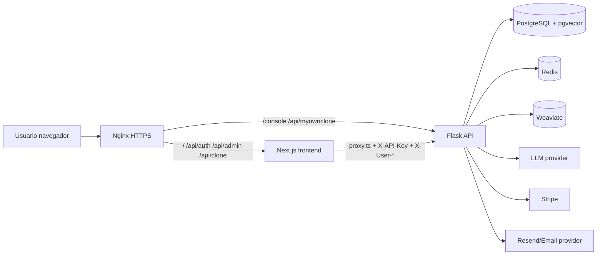
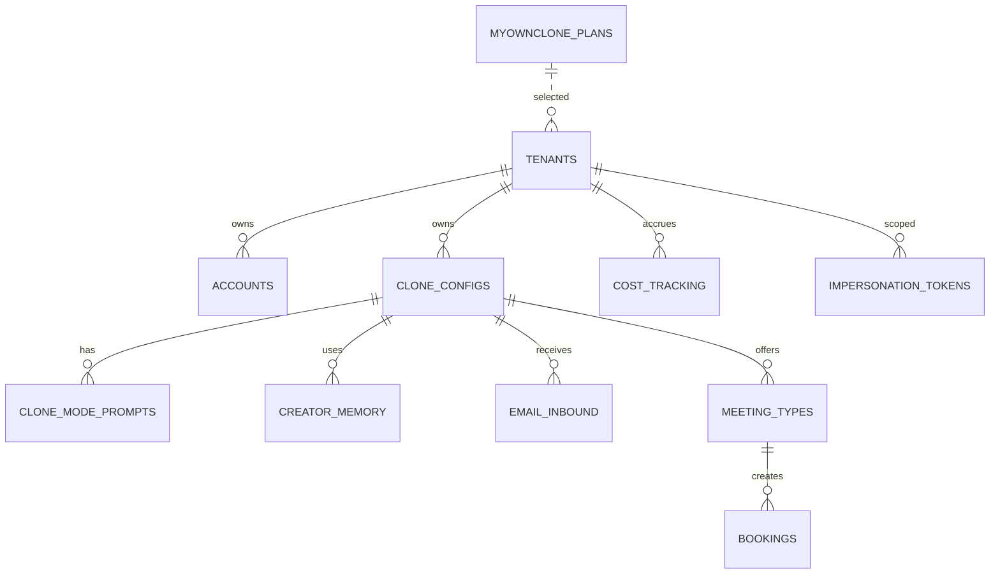

# 03 - Auditoría técnica completa

Fecha: 2026-06-15  
Proyecto: MyOwnClone  
Stack auditado: Flask, PostgreSQL/pgvector, Redis, Weaviate, Next.js 16, React 19, NextAuth 5, Stripe, Resend, Docker, Nginx, systemd.

## 1. Arquitectura

**Fortalezas**

- Separación razonable entre frontend (`MyOwnClone/`) y backend (`api/`).
- Backend mantiene modelo multi-tenant con `tenants`, `accounts`, clones, billing, analytics e impersonation.
- Deploy scripts existen y encapsulan backend/frontend.
- Rutas públicas de chat están separadas de rutas console protegidas.

**Debilidades**

- Dos capas de autenticación: NextAuth JWT en frontend y JWT/service headers en Flask. Es funcional, pero frágil si Nginx salta Next.
- Dos esquemas de usuario (`accounts` canónico backend y `users` legacy NextAuth) requieren consolidación futura.
- Nginx productivo tuvo hotfix manual; ahora hay plantilla, pero falta automatizar aplicación.
- `package-lock.json` está desincronizado y fuerza `npm install` en producción.

## 2. Código

**Calidad**

- La base tiene módulos claros: `api/controllers`, `api/models`, `api/libs`, `MyOwnClone/src/app`, `src/lib`, `src/components`.
- Hay tests backend de seguridad/smoke, tests frontend de componentes y páginas.
- Se observa lógica crítica en middleware/proxy; debe mantenerse con tests porque errores de proxy causan 401 globales.

**Riesgos de deuda**

- Controladores Flask con consultas y reglas de negocio en el mismo archivo.
- Páginas dashboard client-side duplican patrones de carga/error.
- `admin_platform.py` es grande; conviene dividir servicios de dominio.
- Lockfile roto impide reproducibilidad.

## 3. Seguridad

**Autenticación y autorización**

- Backend usa JWT HS256 y valida secretos fuertes en producción.
- `login_required` acepta Bearer JWT o service-to-service `X-API-Key` + identidad reenviada.
- Next proxy exige sesión y rol `platform_admin` para `/api/admin/*`.
- Riesgo: si Nginx apunta `/api/admin/*` directo a Flask sin service headers, se rompe el dashboard.

**Secretos**

- `.gitignore` cubre `.env`, `.env.local`, `__pycache__`, `.pyc`, `node_modules`, `.next`.
- Búsqueda local no encontró secretos reales evidentes en fuente; sí hay valores de test y placeholders.
- El remote del workspace principal contenía token embebido en URL; no debe mostrarse ni persistirse en documentación. Recomendado rotar credencial si fue expuesta en terminal compartida.

**Web**

- Nginx aplica cabeceras básicas (`HSTS`, `X-Frame-Options`, `nosniff`, `Referrer-Policy`) en producción según configuración observada.
- Falta política CSP gestionada como código/versionada completa.
- CSRF: NextAuth gestiona auth CSRF; hay `/api/csrf` local para flujos propios.

## 4. Dependencias

**Frontend**

- Next 16.2.9, React 19.2.4, NextAuth beta.
- `overrides` fuerzan versiones de `esbuild`, `postcss`, `vite`.
- Bloqueante: `package-lock.json` no coincide con `package.json`.

**Backend**

- `requirements.txt` usa rangos `>=`; flexible pero menos reproducible.
- Recomendado generar `requirements.lock` o usar `pip-tools`/uv.

## 5. Base de datos

**Modelo principal**

**Observaciones**

- Migraciones Alembic cubren tablas base, MyOwnClone, índices, admin audit log y pgvector.
- Faltan evidencias de backup/restore automatizado.
- Weaviate y pgvector coexisten; conviene documentar qué búsquedas usan cada motor.

## 6. Testing

**Cobertura existente**

- Backend: smoke, seguridad, admin auth, tenant scoping, Stripe webhook, inbox, retrieval.
- Frontend: login, registro, billing/planes, admin audit, chat, search command bar.
- E2E Playwright existe pero requiere datos/sesión para eliminar skips.

**Huecos críticos**

- E2E autenticado de login -> admin overview -> clone dashboard.
- Smoke contra Nginx real con cookie NextAuth.
- Prueba de que `/api/admin/*` pasa por Next y no directo a Flask.

## 7. CI/CD

`.github/workflows/ci.yml` existe. Debe validar:

- Python tests.
- Frontend typecheck/test.
- Build.
- Lockfile.
- Deploy scripts con `shellcheck`.
- Nginx template con `nginx -t` en contenedor.

## 8. Observabilidad

**Actual**

- systemd journal para frontend.
- Docker logs para backend y dependencias.
- Healthchecks `/healthz`, `/readyz`.
- Smoke script `ops/smoke-prod.sh`.

**Pendiente**

- Alertas 5xx y latencia.
- Centralización de logs.
- Sentry/OpenTelemetry.
- Métricas de Stripe webhooks, colas, LLM coste y fallos.

## 9. Documentación

**Existente**

- `README.md`, `ARCHITECTURE.md`, `DEPLOYMENT.md`, `AUDIT_REPORT.md`, `SETUP.md`, `ROADMAP.md`.

**Nuevos entregables**

- Índice maestro `docs/README.md`.
- Auditoría en `docs/auditoria/`.
- Manual técnico en `docs/manual-tecnico/README.md`.
- Manual usuario en `docs/manual-usuario/README.md`.

## 10. Conclusión

El sistema está operativo y tiene una base de seguridad razonable, pero la operación de producción depende de varias piezas frágiles: Nginx debe enrutar a Next correctamente, el lockfile debe repararse para despliegues reproducibles y falta automatizar backups/observabilidad. Las remediaciones de bajo riesgo aplicadas reducen drift y documentan los incidentes recientes.

