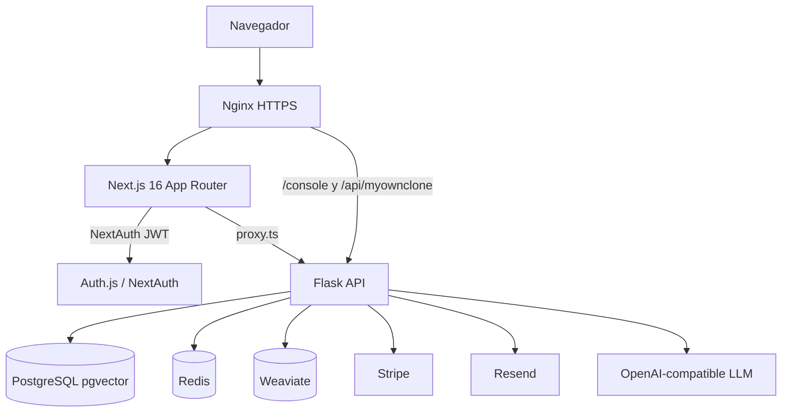
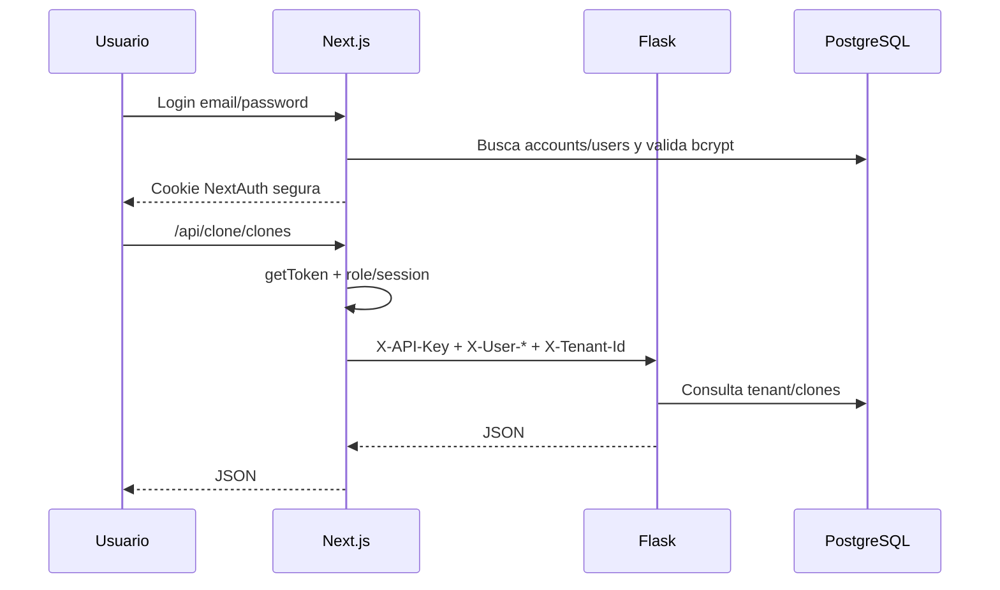

# Manual técnico y de administración

## 1. Visión general del sistema

MyOwnClone es una plataforma SaaS multi-tenant para crear clones IA con chat público, modos de respuesta, memoria del creador, email triage, booking, productos, analíticas, billing e impersonation de administración.

## 2. Arquitectura técnica



## 3. Stack tecnológico

- Frontend: Next.js 16, React 19, TypeScript, Tailwind v4, NextAuth 5.
- Backend: Flask 3, Flask-RESTX, SQLAlchemy 2, Flask-Migrate/Alembic.
- Datos: PostgreSQL 15 + pgvector, Redis 7, Weaviate 1.24.
- Infra: Docker Compose, Nginx, systemd, Let's Encrypt.
- Integraciones: Stripe, Resend, proveedor LLM compatible OpenAI.

## 4. Estructura del repositorio

```text
MyOwnClone/              # Frontend Next.js
api/                     # Backend Flask
ops/                     # Deploy, env examples, Nginx template, smoke tests
docs/                    # Documentación operativa
tests/                   # Tests backend top-level
api/tests/               # Tests backend adicionales
```

## 5. Componentes y módulos

- `MyOwnClone/src/lib/auth.ts`: NextAuth, credentials, Google, Resend.
- `MyOwnClone/src/proxy.ts`: proxy frontend -> backend, auth de sesión y service key.
- `api/controllers/console/myownclone/*`: APIs console protegidas.
- `api/controllers/console/auth.py`: login JWT backend.
- `api/libs/login.py`: decorador `login_required` y service-to-service headers.
- `api/models/myownclone/*`: modelo de dominio SaaS.
- `ops/deploy-frontend.sh`: despliegue frontend por releases.
- `ops/deploy-backend.sh`: despliegue backend Docker Compose.

## 6. Lógica de negocio principal



## 7. Flujos del sistema

- Login admin: `/login` -> NextAuth -> `/admin/resumen`.
- Dashboard usuario: `/resumen`, `/biblioteca`, `/cerebro`, `/inbox`, `/productos`.
- Planes/upgrade: `/planes` -> `/api/clone/plans` -> `/api/clone/stripe/checkout`.
- Billing: `/facturacion` -> `/api/clone/billing` -> portal Stripe si existe.
- Chat público: `/api/public/clones/:slug/chat` -> Flask public API SSE.

## 8. Modelo de datos

Ver diagrama ER en `docs/auditoria/03-auditoria-tecnica-completa.md`.

Tablas clave: `tenants`, `accounts`, `clone_configs`, `clone_mode_prompts`, `creator_memory`, `email_inbound`, `meeting_types`, `availability`, `bookings`, `products`, `cost_tracking`, `analytics_questions`, `analytics_gaps`, `impersonation_log`, `impersonation_tokens`, `myownclone_plans`.

## 9. Integraciones externas

- Stripe: checkout, portal, webhooks.
- Resend: email transaccional.
- LLM: `OPENAI_API_BASE`/`OPENAI_BASE_URL`, `OPENAI_API_KEY`, modelo configurable.
- Weaviate: vector search externo.

## 10. Setup y configuración

Variables importantes:

- Frontend: `DATABASE_URL`, `AUTH_URL`, `AUTH_SECRET`, `NEXTAUTH_URL`, `SERVICE_API_KEY`, `MYOWNCLONE_API_URL`, `PLATFORM_ADMIN_EMAIL`, `PLATFORM_ADMIN_PASSWORD_HASH`.
- Backend: `DB_HOST`, `DB_PASSWORD`, `REDIS_PASSWORD`, `JWT_SECRET_KEY`, `SERVICE_API_KEY`, `WEAVIATE_API_KEY`, `STRIPE_SECRET_KEY`, `STRIPE_WEBHOOK_SECRET`, `RESEND_API_KEY`.

Instalación local:

```bash
cd api
python -m venv .venv
. .venv/Scripts/activate  # Windows PowerShell usa .venv\Scripts\Activate.ps1
pip install -r requirements.txt

cd ../MyOwnClone
npm install
npm run dev
```

## 11. Despliegue

Rutas VPS conocidas:

- Root app: `/opt/myownclone`
- Release activa: `/opt/myownclone/current`
- Releases: `/opt/myownclone/releases`
- Shared env: `/opt/myownclone/shared`
- Frontend env real: `/opt/myownclone/shared/frontend.env.production`
- Backend env real: `/opt/myownclone/shared/backend.env.production`

Frontend:

```bash
bash ops/deploy-frontend.sh
```

Backend:

```bash
bash ops/deploy-backend.sh
```

Nginx:

```bash
sudo cp ops/nginx.myownclone.conf.example /etc/nginx/sites-available/myownclone
sudo ln -sfn /etc/nginx/sites-available/myownclone /etc/nginx/sites-enabled/myownclone
sudo nginx -t
sudo systemctl reload nginx
```

## 12. Administración del sistema

Comandos útiles:

```bash
systemctl status myownclone-frontend --no-pager
journalctl -u myownclone-frontend -n 200 --no-pager
docker ps
docker logs myownclone_api --tail 200
docker exec -it myownclone_postgres psql -U postgres -d myownclone
```

## 13. Procesos automáticos

No se confirmaron cronjobs activos el 2026-06-15 por falta de SSH. Revalidar:

```bash
find /etc/cron* /var/spool/cron -maxdepth 2 -type f -print 2>/dev/null
systemctl list-timers --all
```

## 14. Monitoreo y logs

- Frontend: `journalctl -u myownclone-frontend`.
- Backend: `docker logs myownclone_api`.
- Nginx: `/var/log/nginx/access.log`, `/var/log/nginx/error.log`.
- Health: `/healthz`, `/readyz`, `/api/auth/session`.

## 15. Troubleshooting

| Síntoma | Diagnóstico | Solución |
|---|---|---|
| Login vuelve a `/login` | Revisar `/api/auth/session`, cookies y `AUTH_SECRET`. | Borrar cookies; verificar env systemd. |
| `/api/admin/overview` 401 | Nginx puede estar saltando Next o `getToken` no lee cookie. | Revisar `ops/nginx.myownclone.conf.example` y `src/proxy.ts`. |
| Bcrypt admin inválido | Dotenv expande `$` en `.env.production`. | No poner `PLATFORM_ADMIN_*` en `.env.production`; cargar desde systemd env file. |
| Deploy falla con `npm ci` | Lockfile desincronizado. | Regenerar `package-lock.json`; temporalmente usar `npm install --legacy-peer-deps`. |

## 16. Backups y recuperación

Pendiente P1: automatizar `pg_dump` cifrado y restore test.

Ejemplo:

```bash
docker exec myownclone_postgres pg_dump -U postgres myownclone | gzip > myownclone-$(date +%F).sql.gz
```

Rollback frontend:

```bash
ln -sfn /opt/myownclone/releases/<release-anterior> /opt/myownclone/current
systemctl restart myownclone-frontend
```

## 17. Seguridad operativa

- Nunca commitear `.env`.
- Permisos env: `0600`.
- Rotar tokens al terminar accesos temporales.
- Validar `ALLOW_DEV_SERVICE_KEY=false` en producción.
- Usar `nginx -t` antes de reload.

## 18. Mantenimiento

- Semanal: revisar logs 5xx y espacio disco.
- Mensual: restaurar backup en entorno temporal.
- Por release: ejecutar typecheck/tests/smoke.
- Trimestral: rotar secretos críticos.

## 19. Roadmap técnico

1. Lockfile reproducible.
2. Backups automatizados.
3. Observabilidad centralizada.
4. Consolidación `accounts`/`users`.
5. CI con smoke/Nginx/shellcheck.

## 20. Glosario técnico

- Tenant: cliente/espacio lógico aislado.
- Clone: asistente IA configurado para un creador.
- Service key: clave interna Next -> Flask.
- Release: snapshot desplegable bajo `/opt/myownclone/releases`.
- Shared env: configuración persistente no versionada del VPS.

